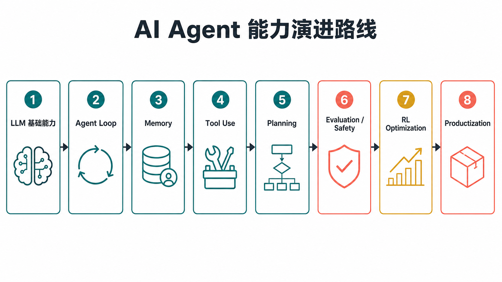
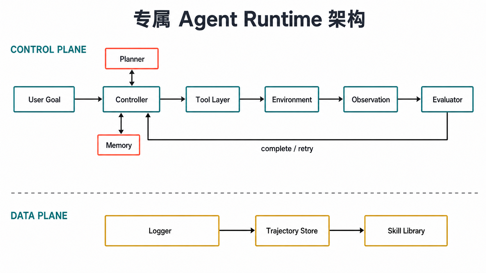
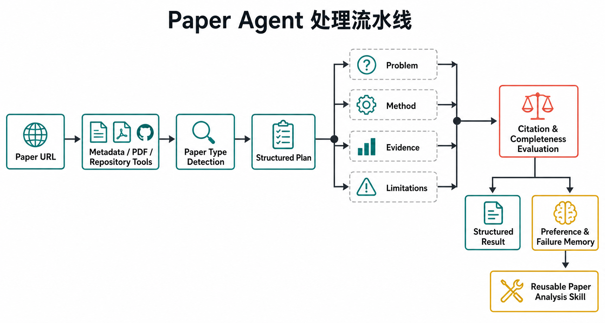
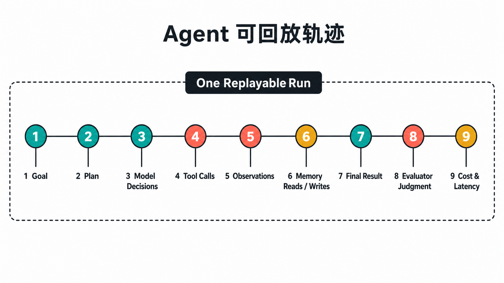

# AgentCraft

[English](README.md) | [简体中文](README.zh-CN.md)

连接 **AI Agent 理论、关键论文与工程实现** 从0实现一个AI Agent。

本项目试图回答三个问题：

1. AI Agent 为什么能从语言模型发展成可以持续行动的系统？
2. Memory、Tool Use、Planning、Evaluation、Safety 和 Agent RL 等关键论文，分别解决了什么问题？
3. 如何把这些理论落实为一个可观测、可恢复、可评估的专属 Agent？

项目不会把 Agent 简化成一个超长 Prompt，也不绑定特定模型厂商或 Agent 框架。这里把 Agent 看成一个持续运行的决策系统：LLM 提供认知能力，Agent Loop 连接观察与行动，Memory 保持任务连续性，Tool Use 接入外部世界，Planning 处理长任务，Evaluation/Safety 约束结果与权限，轨迹数据则为技能沉淀和 RL 优化提供基础。



当前仓库包含：

- 8 个 Agent 核心主题与 31 篇代表性论文的概要、详解和本地原文
- Agent 系统架构、实现里程碑和评估指标
- 可直接运行的 Go Paper Agent Runtime
- 论文研究图谱、飞书论文合集与 URL 索引
- 交互式 Web 站点与本地论文阅读器
- 跨平台构建、CodeQL、依赖审计、Trivy 全库扫描、SPDX SBOM 和签名发布流程

## 快速开始

要求 Node.js 20 或更高版本，以及 Go 1.25 或更高版本。离线 Demo 不需要 API Key。首次运行先下载本地论文缓存：

```bash
git clone git@github.com:LucasZhang6/AgentCraft.git
cd AgentCraft
npm run papers:download
npm run dev
```

浏览器访问 `http://127.0.0.1:4173`。站点默认显示英语，可在任意页面切换到简体中文。下载完成后，31 个论文条目会复用 25 份核心 PDF，并为组合条目补充 Constitutional AI，共缓存 26 份本地论文，可以在断网状态下打开；PDF 缓存不提交到 Git，来源与校验规则见 [本地论文缓存说明](ai-agent-roadmap-site/assets/pdfs/README.zh-CN.md)。

站内阅读器使用本地 vendored 的 [Mozilla PDF.js](ai-agent-roadmap-site/assets/vendor/pdfjs/NOTICE.md) 渲染论文，支持翻页、缩放和下载，不依赖浏览器自带 PDF 插件。

运行全部检查：

```bash
npm test
npm run papers:verify
```

统一构建站点、CLI、HTTP Server 和飞书适配器：

```bash
make build
```

二进制输出到 `dist/bin/`。

运行 Paper Agent Runtime：

```bash
npm run agent -- "解读一篇关于 Agent Memory 的论文"
```

该命令会执行完整 Agent Loop，并在 `.agent-data/` 中记录结构化消息、工具调用与结果、计划步骤、Goal、指标、记忆和轨迹。真实 Provider 还支持流式输出、模型回退和 Prompt Cache 统计。

持久 readline 模式使用 `dist/bin/paper-agent -interactive`，全屏终端使用 `-tui`；运行 `dist/bin/paper-agent-server` 后可直接打开 `http://127.0.0.1:18080/`。飞书接入和服务端配置见 [飞书适配器](docs/feishu-adapter.zh-CN.md)。

## Agent 的系统模型

一个可用 Agent 不是单次模型请求，而是带状态、预算、权限和停止条件的运行时：



| 模块 | 核心职责 | 必须回答的问题 |
| --- | --- | --- |
| Model Provider | 理解、推理、生成结构化决策 | 用哪个模型，如何控制上下文、成本和重试？ |
| Controller | 驱动 Observe -> Decide -> Act 循环 | 下一步是回答、规划、调用工具、询问还是停止？ |
| Planner | 把目标转成可执行步骤 | 步骤依赖、预算、风险和完成条件是什么？ |
| Tool Layer | 执行搜索、文件、API、代码等真实动作 | 参数是否合法，权限是否足够，失败如何处理？ |
| Memory | 管理短期状态、长期事实和历史经验 | 记什么、何时取、如何更新、何时删除？ |
| Evaluator | 判断任务是否真正完成 | 结果是否正确、有证据、未越权且成本可接受？ |
| Logger | 保存可回放的完整轨迹 | 哪一步失败，消耗多少，能否形成训练或评估数据？ |
| Skill Library | 固化验证过的重复流程 | 何时触发，依赖哪些工具，成功率和适用范围如何？ |

更完整的模块边界见 [专属 Agent 架构](docs/architecture.zh-CN.md)。

## 关键论文解读

论文部分约占本项目核心内容的 40%。站内条目分为可快速浏览的“论文概要”和不少于 200 字的“详细解读”；详解不只总结方法，还会继续追问它改变了 Agent 的哪个模块、引入了什么成本和风险，以及如何用真实任务验证。

### 1. LLM 基础能力：Agent 的认知底座

#### [Attention Is All You Need](ai-agent-roadmap-site/assets/pdfs/attention-is-all-you-need.pdf)

Transformer 用 self-attention 代替循环结构，使每个 token 可以直接聚合上下文中的其他信息。对 Agent 而言，目标、历史轨迹、工具结果、计划和记忆最终都要进入模型上下文。这篇论文也解释了 Agent 的第一个系统瓶颈：上下文不是无限资源，历史越长，计算成本、噪声和错误关注都会增加。Memory、摘要、检索和上下文压缩，本质上都在解决“下一步决策到底需要看什么”。

#### [Language Models are Few-Shot Learners](ai-agent-roadmap-site/assets/pdfs/language-models-are-few-shot-learners.pdf)

GPT-3 展示了 in-context learning：模型不修改参数，也能通过任务描述和少量示例临时适配新任务。这成为早期 Agent 的工程基础，system prompt 定义角色，few-shot 示例定义行为，工具说明定义可选动作。但 Prompt 越长、职责越多，行为越容易漂移。因此成熟 Agent 会把角色、工具、记忆、规划和评估拆成独立模块，而不是继续堆叠提示词。

#### [Chain-of-Thought Prompting](ai-agent-roadmap-site/assets/pdfs/chain-of-thought-prompting.pdf)

CoT 通过显式中间步骤提升复杂推理能力，是 Agent Planning 的重要前身。不过自然语言推理链并不等于执行计划：它缺少稳定的依赖关系、状态、预算和验收条件，也可能形成逻辑流畅但事实错误的自我说服。工程上可以用 CoT 产生候选思路，但执行层应转换成 JSON plan、DAG、任务队列或状态机。

#### [Retrieval-Augmented Generation](ai-agent-roadmap-site/assets/pdfs/retrieval-augmented-generation.pdf)

RAG 把模型参数与外部可检索知识结合起来。它让知识可以更新、引用和追溯，也为 Agent Memory 提供了基础范式。Agent 的长期记忆可以视为从“检索百科文档”扩展到“检索用户偏好、任务历史、失败案例和技能”。真正困难的部分不是使用向量数据库，而是决定哪些内容值得写入、如何处理冲突、何时召回以及如何防止不可信内容污染未来决策。

#### [Toolformer](ai-agent-roadmap-site/assets/pdfs/toolformer.pdf)

Toolformer 研究模型如何学习调用外部 API，包括何时调用、调用哪个工具、参数怎么填以及如何利用返回结果。它标志着 LLM 从“生成答案”向“选择动作”演进。工程系统还需要补上论文没有覆盖的边界：工具 schema、参数校验、权限等级、超时、错误类型、幂等性、审计和人工确认。

#### [InstructGPT / RLHF](ai-agent-roadmap-site/assets/pdfs/instructgpt-rlhf.pdf) 与 [Constitutional AI](ai-agent-roadmap-site/assets/pdfs/constitutional-ai.pdf)

RLHF 用人类偏好调整模型行为，Constitutional AI 则把行为原则显式化，让模型进行批评和修正。Agent 会写文件、联网、调用 API 和保存用户信息，因此对齐不能只停留在回答风格。工程中的“宪法”应变成可执行策略：哪些工具默认拒绝，哪些动作必须确认，哪些来源能进入长期记忆，什么情况下必须降级或停止。

### 2. Agent Loop：从模型调用到持续行动

#### [A Survey on Large Language Model based Autonomous Agents](ai-agent-roadmap-site/assets/pdfs/llm-autonomous-agents-survey.pdf)

这篇综述将 Agent 拆为 profiling、memory、planning 和 action，提供了理解 Agent 系统的基本坐标。它最重要的工程启发是：Agent 不是某一个模型，也不是某一个框架，而是多个状态模块围绕任务目标组成的运行时。一次任务至少需要明确输入状态、可选动作、环境反馈、记忆更新和停止条件。

#### [The Rise and Potential of Large Language Model Based Agents](ai-agent-roadmap-site/assets/pdfs/rise-and-potential-of-llm-agents.pdf)

论文从 brain、perception 和 action 三个方向建立早期 Agent 全景图。文本、图像、网页和环境状态属于感知，LLM 负责决策，工具或执行器负责行动。不同 Agent 产品虽然外观差异很大，但主要变化仍集中在环境接口、状态表示、动作风险和完成判定。

#### [Toward Efficient Agents](ai-agent-roadmap-site/assets/pdfs/toward-efficient-agents.pdf)

这篇综述把重点从“Agent 能不能完成任务”推进到“Agent 能否以合理成本完成任务”。成本不仅是 token，还包括工具调用、记忆读写、规划搜索、失败重试和多 Agent 通信。高效 Agent 不是一味减少步骤，而是在固定效果下降低成本，或在固定预算下提升成功率。项目因此从第一版开始记录 latency、tokens、tool calls、retries 和 task success。

### 3. Memory：让 Agent 具有连续性

#### [Memory in the LLM Era](ai-agent-roadmap-site/assets/pdfs/memory-in-the-llm-era.pdf)

这篇综述把记忆看成独立系统，讨论短期状态、长期存储、参数化记忆、检索、更新与遗忘。工程上应至少区分当前任务上下文、用户确认事实、历史任务经验和可复用技能。它们具有不同的生命周期与权限，不能全部写入同一个向量库。

#### [A-MEM: Agentic Memory for LLM Agents](ai-agent-roadmap-site/assets/pdfs/a-mem-agentic-memory.pdf)

A-MEM 反对 append-only 的记忆方式。持续追加对话摘要会产生重复、过时和矛盾，最终降低检索质量。Agent Memory 应支持 ADD、UPDATE、MERGE、DELETE 和 RETRIEVE，并建立记忆之间的关联。实际实现还要为每条记忆记录来源、置信度、作用域、更新时间和用户确认状态。

#### [HiAgent](ai-agent-roadmap-site/assets/pdfs/hiagent.pdf)

HiAgent 用层级工作记忆处理长程任务。复杂任务不适合把全部历史重新塞回上下文，可以拆成 recent context、episode summary 和 long-term memory：最近步骤保存细节，阶段摘要保存决策，长期记忆保存稳定经验。这个结构能同时控制上下文长度和信息损失。

#### [AgentPoison](ai-agent-roadmap-site/assets/pdfs/agentpoison.pdf)

AgentPoison 说明长期记忆和 RAG 知识库也是攻击面。恶意内容不必立即影响当前回答，只要进入长期存储，就可能在未来被检索并触发错误动作。因此记忆写入必须带 provenance 和 trust level；来自网页、工具输出和共享空间的内容默认应视为不可信，高风险动作不能由一条检索记忆直接授权。

### 4. Tool Use、Workflow 与 Planning

#### [AutoGen](ai-agent-roadmap-site/assets/pdfs/autogen.pdf)、[MetaGPT](ai-agent-roadmap-site/assets/pdfs/metagpt.pdf) 与 [AFlow](ai-agent-roadmap-site/assets/pdfs/aflow.pdf)

AutoGen 用消息协议组织 Agent、工具和人工反馈；MetaGPT 用角色、SOP 和结构化交付物组织软件工程流程；AFlow 则进一步把 workflow 当作可搜索和优化的对象。三者共同说明，复杂 Agent 的核心不是角色数量，而是清晰的输入输出协议、状态所有权、验收条件和通信成本。第一版专属 Agent 通常应保持单 Agent，等真实瓶颈出现后再拆分角色。

#### [Understanding the Planning of LLM Agents](ai-agent-roadmap-site/assets/pdfs/understanding-the-planning-of-llm-agents.pdf)

这篇综述覆盖任务分解、计划生成、行动选择、执行监控、失败恢复和重规划。工程中的计划不应只是一段自然语言，而应包含 `id`、`dependencies`、`tool`、`risk`、`budget`、`success_criteria` 和 `status`。只有计划能改变系统状态，Agent 才能恢复长任务并判断何时停止。

#### [Scaling Large Language Model-based Multi-Agent Collaboration](ai-agent-roadmap-site/assets/pdfs/scaling-llm-multi-agent-collaboration.pdf)

多 Agent 可以带来并行和角色专长，也会引入消息膨胀、重复工作、错误传播和协调成本。是否拆分多 Agent 应由任务结构决定：当子任务可以独立验证、并行收益明显或权限必须隔离时，多 Agent 才更有价值。否则增加角色通常只是增加 token 和不确定性。

### 5. Evaluation、Safety 与 Agent RL

#### [SPA-Bench](ai-agent-roadmap-site/assets/pdfs/spa-bench.pdf) 与 [CyBench](ai-agent-roadmap-site/assets/pdfs/cybench.pdf)

SPA-Bench 在真实移动环境中评估 Agent 是否完成了状态改变，而不是是否声称完成；CyBench 通过可执行网络安全任务评估能力与风险。两者都强调环境证据的重要性。Evaluator 应优先检查测试结果、schema、文件状态、引用和外部环境，而不是只让另一个 LLM 对最终文本打分。

#### [Direct Preference Optimization](ai-agent-roadmap-site/assets/pdfs/direct-preference-optimization.pdf)

DPO 直接使用成对偏好数据优化模型，简化了 reward model + PPO 的传统流程。对 Agent 来说，偏好数据不只是“哪个回答更好”，还可以比较完整轨迹：少调用无关工具、先澄清再执行、引用可验证来源、在高风险动作前请求确认。这要求系统先保存结构化轨迹，而不是只保存最终答案。

#### [DeepSeek-R1](ai-agent-roadmap-site/assets/pdfs/deepseek-r1.pdf) 与 [Search-R1](ai-agent-roadmap-site/assets/pdfs/search-r1.pdf)

DeepSeek-R1 展示了 RL 对推理策略的塑造能力，Search-R1 将这一思路推进到“推理 + 搜索工具”。对 Agent 最有价值的启发是奖励必须与任务真实结果绑定：代码是否通过测试、搜索证据是否支持结论、工具是否改变了正确环境状态。只奖励长推理或调用次数，容易产生奖励投机。

#### [AgentGym-RL](ai-agent-roadmap-site/assets/pdfs/agentgym-rl.pdf) 与 [SkillRL](ai-agent-roadmap-site/assets/pdfs/skillrl.pdf)

AgentGym-RL 面向长程、多轮、交互式轨迹训练；SkillRL 关注把成功经验沉淀为可复用技能。二者对应专属 Agent 的后期演进：先保存 `goal -> plan -> action -> observation -> result -> evaluation`，再从高质量轨迹构造偏好对、技能或奖励。没有稳定环境、评估集和轨迹日志时，不应过早进入 RL 阶段。

## 论文与项目资源

- 飞书原始页面属于私有研究来源，公开仓库不披露源链接；本项目只保留公开论文与项目链接。
- [飞书正文 Markdown 镜像](docs/feishu-agent-papers-and-projects.zh-CN.md)
- [按 Agent 模块整理的扩展研究地图](agent_research_map_from_feishu_urls.zh-CN.md)
- [正文 URL 去重索引](feishu_agent_urls.zh-CN.md)
- [交互式论文图谱](ai-agent-roadmap-site/)

Markdown 镜像保留飞书接口返回的完整正文和原始换行，方便离线检索、版本管理和后续分类。论文著作权归原作者所有，本项目只保存链接和原创解读，不分发论文全文。

## 从理论到专属 Agent

推荐从一个边界清晰的单 Agent 开始。先建立可验证闭环，再逐步增加能力。

| 阶段 | 需要实现 | 验收条件 |
| --- | --- | --- |
| 1. 定义场景 | 明确用户、输入、输出、环境和高风险动作 | 能写出 20 个固定真实任务，不用“智能”描述目标 |
| 2. Agent Loop | Controller、状态、最大步数、时间与成本预算 | 每轮决策可记录，网络或工具失败后能安全停止 |
| 3. Tool Layer | Tool Registry、schema、权限、超时、重试、审计 | 未注册工具和非法参数默认拒绝，写操作可确认 |
| 4. Memory | 短期状态、用户事实、任务经验、来源与删除 | 能解释每条记忆从哪里来、为何写入、何时失效 |
| 5. Planning | 结构化步骤、依赖、风险、完成条件和重规划 | 中断后可恢复，步骤完成由证据而不是模型自报决定 |
| 6. Evaluation/Safety | 真实任务集、外部验证、权限矩阵、失败分类 | 每次变更可比较成功率、成本、延迟和安全行为 |
| 7. Skills/RL | 轨迹筛选、偏好对、技能版本和策略优化 | 只有离线回归稳定后，优化策略才能进入默认路径 |
| 8. Productization | Provider 路由、持久化、队列、监控、发布门禁 | 可恢复、可审计、可限额，并能处理部分依赖故障 |

### 专属 Agent 的配置面

专属 Agent 的“专属”不应只体现在 system prompt。一个可维护的实现，至少要把领域差异拆成以下配置面：

```yaml
identity:
  role: 这个 Agent 负责什么
  boundaries: 明确不负责什么

model:
  default: 常规任务模型
  escalation: 复杂任务升级策略
  context_budget: 单轮上下文预算

tools:
  allowlist: 可调用工具
  permissions: 只读、写入、高风险
  timeout_and_retry: 超时与重试策略

memory:
  schemas: 用户事实、任务经验、技能
  write_policy: 自动、候选、用户确认
  retention: 更新、过期、删除规则

policy:
  confirmation: 必须人工确认的动作
  source_trust: 不同来源的信任等级
  limits: token、时间、费用和调用次数

evaluation:
  tasks: 固定真实任务集
  success_criteria: 可程序验证的完成条件
  metrics: 效果、成本、安全和人工介入
```

模型 Provider、工具实现和存储后端可以替换，但这些配置及其语义应该保持稳定。这样才能比较不同模型和 workflow，而不是每换一次框架就重写整个系统。

### 理论如何落到代码里

论文中的概念只有进入稳定接口和可观测数据，才能成为工程能力。下面这张映射表可以作为实现时的模块清单：

| 理论模块 | 代码中的主要接口 | 运行时应保存的数据 | 最小验证方式 |
| --- | --- | --- | --- |
| LLM 基础能力 | `ModelProvider.generate(decisionContext)` | 模型、提示版本、输入摘要、token、延迟 | 固定任务在不同模型和提示版本间可回归比较 |
| Agent Loop | `Controller.run(goal, state)` | 当前步骤、剩余预算、动作、观察、停止原因 | 工具连续失败或预算耗尽时不会无限循环 |
| Memory | `remember`、`retrieve`、`update`、`forget` | 内容、来源、作用域、置信度、时间和版本 | 错误记忆可追溯、修正、过期和删除 |
| Tool Use | `ToolRegistry.execute(name, args, context)` | 工具名、参数、权限判断、结果、错误和耗时 | 未注册工具、非法参数和越权写入均被拒绝 |
| Planning | `Model.CreatePlan`、`Replan` | 步骤、依赖、状态、预算、风险和验收条件 | 中断恢复后不会重复已完成的不可逆动作 |
| Evaluation | `Evaluator.check(result, evidence)` | 任务结果、外部证据、评分、失败类型 | 模型声称完成但缺少真实证据时判定失败 |
| Safety | `PolicyEngine.authorize(action)` | 策略版本、风险等级、确认人和拒绝原因 | 高风险动作无法绕过宿主程序直接执行 |
| Skills / RL | `TrajectoryStore`、`SkillRegistry` | 完整轨迹、奖励、偏好对、技能版本 | 新策略只有通过离线任务集才进入默认路径 |

模块之间建议使用显式的动作契约，而不是传递无法校验的自然语言。例如 Controller 每轮只接受以下决策之一：

```json
{
  "type": "tool_call",
  "tool": "search_papers",
  "arguments": { "query": "agent memory" },
  "reason": "需要补充一手来源",
  "expected_observation": "包含论文元数据和可访问链接"
}
```

宿主程序先校验 `type`、工具白名单、参数 schema、权限和预算，再决定是否执行。工具结果以 Observation 返回下一轮，而不是让模型假定动作已经成功。这条边界使模型可以灵活推理，同时让真实世界的副作用仍由确定性代码控制。

### 工程完成标准

一个 Demo 能运行，不等于 Agent 已经可以使用。进入真实工作流前，至少应满足以下条件：

- **可重复**：相同任务在固定环境中有可比较的结果，而不是只展示一次成功案例。
- **可恢复**：进程退出、网络中断或工具超时后，可以从已保存状态继续或明确失败。
- **可解释**：能查看计划、工具参数、观察结果、记忆来源和最终完成证据。
- **可拒绝**：遇到未知工具、非法参数、越权动作和预算耗尽时默认安全失败。
- **可评估**：每次修改模型、Prompt、工具或流程后，可以重跑同一真实任务集。
- **可删除**：用户能够查看、更正和删除长期记忆，不让错误事实永久影响未来决策。
- **可限额**：单任务具有步数、时间、token、费用和并发限制。
- **可审计**：日志经过敏感信息脱敏，并能关联一次完整任务的输入、动作和结果。

### 第一个专属 Agent 应该做什么

本仓库选择 **Paper Agent** 作为参考实现，因为它能在可控范围内覆盖 Agent 的主要模块：



你可以把相同结构替换成自己的领域：

- 个人研究 Agent：论文、数据集、实验记录和研究偏好
- 编码 Agent：仓库、测试、终端、代码审查和修复轨迹
- SRE Agent：监控、日志、Runbook、变更审批和故障复盘
- 企业知识 Agent：权限检索、业务流程、引用和审计
- GUI Agent：截图感知、动作空间、环境状态和真实成功判定

领域变化时，Controller 的闭环通常不变；主要替换的是工具、记忆 schema、策略规则和评估任务。

## Paper Agent Runtime

`examples/paper-agent/` 使用 Go 实现一个可离线回归、也可连接真实模型的参考 runtime。`context.Context` 负责取消传播，接口隔离 Provider、模型、计划、工具、记忆、Session、评估和日志，论文目录通过 `embed` 编译进二进制：


| 文件 | 职责 |
| --- | --- |
| `cmd/paper-agent/main.go` | 一次性/交互 CLI、持久 Session、审批与终端 UI |
| `cmd/paper-agent-server/main.go` | 异步任务、取消、审批与 Session HTTP API |
| `cmd/feishu-adapter/main.go` | 飞书消息、引用、图片和审批卡片入口 |
| `internal/agent/agent.go` | ReAct、Goal continuation、上下文压缩与停止条件 |
| `internal/session/` | 完整历史持久化、L1 微压缩、L2 digest、L3 异步摘要预热与上下文超限恢复 |
| `internal/provider/openai.go` | OpenAI-compatible Responses Provider、重试与 usage |
| `internal/model/` | 离线 Demo 与真实模型 Planner/Controller |
| `internal/planning/validator.go` | 计划 schema、依赖图和工具引用校验 |
| `internal/tools/` | 风险等级、白名单、审批、超时、输出预算与论文工具 |
| `internal/memory/store.go` | SQLite scope、来源、状态、置信度与预算检索 |
| `internal/metrics/store.go` | 跨运行指标与累计任务成功率 |
| `internal/evaluator/report.go` | 基于验收条件的确定性评估 |
| `internal/trajectory/logger.go` | 可脱敏的 JSONL 轨迹与运行指标 |
| `internal/app/factory.go` | 运行时装配、内置目录与 Run ID |

默认使用确定性的 `DemoModel`，这样工具、记忆、评估和停止行为可以离线回归。设置 `OPENAI_API_KEY`、`OPENAI_MODEL` 和 `-provider openai` 后可连接 OpenAI 或兼容 Responses API 的网关。真实模型生成计划和行动，程序仍负责 DAG、schema、权限、超时、Evaluator 和成本边界。Session 全量历史留在 SQLite；送模视图采用 L1 微压缩、L2 确定性 digest 与 75% 水位异步预热的 L3 模型摘要，Provider 报 context-length 错误时还会进行两级恢复重试。

完整说明见 [Paper Agent Runtime](examples/paper-agent/README.zh-CN.md) 和 [参考实现演进](docs/engineering-practice.zh-CN.md)。

## 评估指标

至少从以下指标开始，避免只凭 Demo 观感判断 Agent 是否变好：

```text
task_success_rate
citation_accuracy
tokens
latency
tool_call_count
retry_count
memory_hit_rate
human_intervention_count
unsafe_action_blocked_count
failure_reason
```

一次完整运行建议保存：



## 仓库结构

```text
.
├── ai-agent-roadmap-site/       # 交互式研究图谱与论文分析
├── examples/paper-agent/        # Go Paper Agent runtime
├── docs/                        # 架构、能力图谱、工程路径与论文合集
├── assets/architecture/         # ImageGen 生成的架构与流程图
├── agent_research_map_from_feishu_urls.md
├── feishu_agent_urls.md
└── package.json
```

重点文档：

- [能力图谱与实现里程碑](docs/roadmap.zh-CN.md)
- [专属 Agent 架构](docs/architecture.zh-CN.md)
- [参考实现演进](docs/engineering-practice.zh-CN.md)
- [论文条目规范](docs/paper-reading-template.zh-CN.md)
- [飞书论文合集 Markdown](docs/feishu-agent-papers-and-projects.zh-CN.md)
- [架构图资产与生成提示](assets/architecture/README.zh-CN.md)

## 设计原则

- **先闭环，再扩能力**：第一版优先保证任务状态可以推进、恢复和停止。
- **效果优先，成本可见**：成功率是前提，同时记录 token、延迟、工具调用与重试。
- **模型提出动作，宿主决定执行**：Prompt 不是权限系统，真实动作必须经过程序校验。
- **记忆具有生命周期**：长期记忆需要来源、置信度、作用域、更新、合并和删除。
- **计划必须可验收**：计划应包含依赖、预算、风险、完成证据和 fallback。
- **Evaluator 独立于生成结果**：优先使用测试、schema、引用和环境状态验证完成。
- **轨迹是未来资产**：评估、偏好优化、技能抽取和 RL 都依赖结构化轨迹。
- **多 Agent 是架构选择，不是默认答案**：只有并行、隔离或专业分工收益明确时才拆分。

## Roadmap

- 扩展关键论文的实验、消融、局限和复现信息
- 增加受限网页抓取、PDF 解析和引用校验工具
- 建立公开、可复现的 Agent 真实任务评估集
- 增加 Memory 冲突检测、来源审计和可解释召回分析
- 为飞书适配器增加长连接与加密回调支持
- 从稳定轨迹中提取可版本化 Skill，并评估其真实收益

## 贡献

欢迎贡献以下内容：

- 新论文解读、事实修正和一手来源
- 可复现的 Agent 工程实验
- Memory、Tool Use、Planning、Evaluation 或 Safety 实现
- 真实任务、失败案例和评估方法
- Web、可访问性和文档改进

提交前请阅读 [CONTRIBUTING.zh-CN.md](CONTRIBUTING.zh-CN.md)。安全问题请按 [SECURITY.zh-CN.md](SECURITY.zh-CN.md) 私下报告，不要在公开 Issue 中披露可利用细节。

## License

代码与原创文字采用 [MIT License](LICENSE)。本地阅读器使用 Apache-2.0 许可的 Mozilla PDF.js，许可文本见 [PDF.js LICENSE](ai-agent-roadmap-site/assets/vendor/pdfjs/LICENSE)。外部论文、项目和原始概念归各自作者与版权方所有，下载的 PDF 只作为本机缓存，不随仓库分发。
