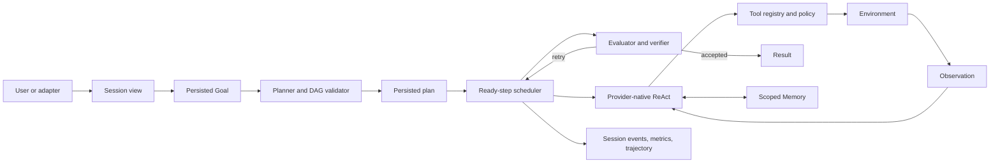

# Your Agent Architecture

[English](architecture.md) | [简体中文](architecture.zh-CN.md)

A useful agent is a state machine, a permission system, and an evidence pipeline
around a model. Your Agent names the user-owned, highly customizable runtime in
this repository. It keeps those responsibilities explicit so each can be
inspected and replaced without granting the model authority over the host.


## System Boundary



The model can propose a plan, tool call, or final result. The host owns schema
validation, execution, permissions, cancellation, persistence, and acceptance.

## Model Provider

`internal/provider` abstracts model transport from Agent behavior. The
OpenAI-compatible implementation uses the Responses API, supports SSE streaming,
custom base URLs, bounded retry, a model fallback chain, prompt-cache keys, and
usage accounting. It exposes tools through the provider's native function-call
schema and restores matching tool results with the original call IDs. A native
tool call is still an untrusted proposal until the host validates and authorizes
it.

Streaming recovery has a side-effect boundary. A broken upstream SSE connection
is retried only before semantic output. Complete `output_item.done` blocks can be
salvaged without replay: valid tool calls execute once, their results are
recorded, and a native user continuation tells the model not to repeat completed
work. Incomplete blocks and malformed arguments are discarded rather than
guessed. User-facing HTTP SSE uses a separate event cursor, so reconnecting a
browser replays current task messages without re-running the model.

The deterministic `DemoModel` implements the same planning and native-turn
interfaces. It makes state, policy, and failure tests independent of network
availability or model drift.

## Scheduler, ReAct, and Goal Continuation

The runtime has three cooperating loops:

- The scheduler loads the persisted DAG, marks dependency-ready steps running,
  and dispatches independent roles concurrently.
- Within each scheduled step, a bounded native ReAct loop performs
  `assistant tool_call -> host execution -> tool_result -> model`.
- Across turns, the persisted Goal continues when the evaluator has not yet
  accepted the result.

Cancellation, pause, evaluator success, explicit budgets, and unrecoverable
errors stop the outer loop. Token and Goal-turn limits default to zero, meaning
unlimited, while `max-steps` bounds model turns within each scheduled step.

Goal state lives in `goals.db`, not in a chat message. It records identity,
status, accumulated tokens and turns, pause/resume/clear transitions, and
whether a future request may auto-resume it.

Within one assistant turn, only tools explicitly marked parallel-capable and
classified `read` may overlap. Concurrency lanes serialize conflicting reads;
write and dangerous tools are always serial. Results are assembled in original
provider-call order before the next model turn. The same rules apply inside an
independent child Agent runtime.

## Planning

The planner returns structured steps containing IDs, descriptions,
dependencies, controlled `allowedTools` sets, roles, success criteria, status,
and acceptance checks. `planning.Validator` rejects missing or duplicate IDs,
unknown dependencies, cycles, unavailable tools, oversized tool sets, invalid
initial state, and empty success criteria. The legacy singular `tool` field is
normalized into `allowedTools` for persisted-plan compatibility.

Validated plans are persisted in `plans.db`. The scheduler only runs steps whose
dependencies are complete and can execute independent roles concurrently.
Deterministic verifiers inspect file or output evidence. A human acceptance
check moves a step to `awaiting_acceptance` until CLI or HTTP approval arrives.
`/plan resume <id>` loads that exact plan, resets an interrupted `running` step
to `pending`, and re-enters scheduler dispatch without re-planning or turning
the plan into prose. Completed steps and their outputs are not repeated.

## Tool Layer

The registry exposes the following built-in capability groups:

- paper catalog lookup and paper-card reading
- workspace file read, write, edit, list, glob, grep, and bounded local semantic symbol search
- bounded shell execution
- web fetch and search
- explicit user clarification
- repository/project/user Markdown Skills
- durable subagents with spawn, status, wait, cancel, and list lifecycle actions
- configured command plugins and MCP stdio tools

Every definition includes a schema and a read, write, or dangerous risk level.
The registry applies an allowlist, argument validation, approval policy, timeout,
serialized output limit, and metrics. Write and dangerous tools require
approval by default. Plugins and MCP tools default to dangerous.

File operations reject workspace and symbolic-link escape. Web operations
reject loopback, private, and link-local targets and unsafe redirects. These
checks are part of a defense in depth model; production deployments still need
OS/process sandboxing, network policy, and narrow credentials.

Skills use YAML frontmatter, dependency checks, per-file limits, and a total
prompt budget. Semantic search builds a local symbol/lexical index over bounded
code files and returns ranked source evidence; it is intentionally not a remote
embedding service. Subagents are records in `subagents.db`, with stable IDs,
parent Session/Run IDs, timeout, cancellation, terminal result, and restart
interruption state. Each child also owns an independent provider-native message
history and bounded ReAct loop. It receives the runtime registry and permission
policy, can compose calls from its authorized tool set, and preserves native
call/result pairs. Recursive subagent creation is excluded by default.

## Session and Context

`sessions.db` uses an ordered canonical event store rather than a transcript
blob. `session_turns` defines the recovery boundary, `session_turn_events`
stores message, runtime, metrics, and terminal-status events, and
`session_messages` plus `session_turn_metrics` are query projections. A turn is
buffered while the Agent runs and all projections are committed in one SQLite
transaction. A failed commit therefore exposes neither partial tool protocol
nor misleading success metrics.

Messages preserve provider-neutral native blocks: text and images,
provider-owned reasoning IDs and encrypted/raw state, tool names and arguments,
tool-call IDs, tool results, errors, and final assistant text. Recovery rebuilds
the same `user -> assistant_blocks -> tool_results -> assistant` conversation
and replays it to the provider as native Responses items. It does not stringify
tool calls or reasoning into a transcript. Orphaned call/result pairs are
removed from the model view, legacy text sessions are migrated into completed
canonical turns, and a fork receives its own reconstructed turn history.
Failed, cancelled, and timed-out turns remain canonical audit events but do not
enter resumable history unless a caller explicitly confirms that their tool
protocol is complete.

A session can be listed, titled, inspected, forked, and deleted through the
Session REST API. Structured messages and canonical events have separate query
endpoints. Status exposes the last
turn state and cumulative token, tool, failure, duration, and success metrics.
Full history is never deleted by compaction.

The model-facing view is reduced in layers:

1. L0 keeps a 4 KB head and tail for old tool results above 16 KB, leaves the
   newest result intact, and bounds repeated or oversized old text.
2. L1 replaces stale results from identical tool/argument calls with compact
   superseded markers while preserving native call/result identity.
3. L2 cuts only at a plain user text/image boundary and creates a deterministic
   digest of older goals, outcomes, failures, and URLs.
4. L3 asynchronously prewarms a semantic model summary at 75% of the configured
   threshold, consumes it only when coverage is sufficient, and falls back to
   L2 on timeout or failure.

L0/L1 also run before every provider call inside an in-flight ReAct step. When
the provider reports a context-length error, that step retries with one recent
turn and then no historical turns; completed tools and native IDs stay in the
local history and are not restarted. The Session layer and the Agent Loop's
recent-observation summary solve different horizons and remain separate.

## Memory

Long-term memory lives in `memory.db`. A record has a scope, key, value, source,
confidence, lifecycle status, and creation/update/use timestamps. `(scope, key)`
is unique, so stable facts are revised instead of appended forever. Retrieval
applies both item-count and byte budgets and ranks candidates by scope,
relevance, confidence, and recency.

Obvious secrets are rejected before write. Retrieved content is still evidence,
not permission. Future work includes explicit candidate confirmation, conflict
merging, expiry rules, and richer deletion/audit interfaces.

## Evaluation and Acceptance

The report evaluator checks deterministic content requirements before a Goal is
completed. Plan steps can additionally require file/output evidence or explicit
human acceptance. The model that generated a result is therefore not the only
judge of completion.

This boundary should become more domain-specific in downstream agents: tests
for code, environment state for operations, citations for research, or a human
decision for irreversible actions.

The Verification Gate is host-owned. If an execution wave performs material
file work, the plan cannot become complete until a verification-class command
has actually succeeded. The gate can append a persisted verification step and
fails closed when that step completes without observed test/build/lint evidence.

## Observability and Persistence

```text
.agent-data/
├── sessions.db
├── goals.db
├── plans.db
├── memory.db
├── metrics.db
├── tasks.db
├── subagents.db
└── runs/<run-id>.jsonl
```

Trajectories retain the complete `goal -> plan -> scheduler waves -> native tool calls ->
observations -> evaluation -> result` event stream with sensitive fields
redacted. Metrics record model calls, input/output/cache tokens, latency, tool
calls and failures, approvals, compactions, Goal turns, and outcome. Session L3
summary usage is recorded separately in `sessions.db`.

## Interfaces

All user surfaces reuse the same runtime semantics:

- one-shot CLI
- persistent readline UI with history and search
- Markdown terminal rendering and full-screen TUI
- Web UI over persistent asynchronous tasks, SSE, Session REST, workspace file
  APIs, and a same-origin WebSocket PTY
- Feishu callback sidecar with durable chat/session mapping, images, quoting,
  cancellation, and approval cards

Adapters do not receive LLM credentials and cannot bypass the runtime tool
policy.

The HTTP task path uses a bounded worker queue with global and per-Session
limits. Different Sessions can run concurrently, while one Session is strictly
serialized to protect canonical turn order. Task messages have monotonic SSE
IDs and can be resumed with `Last-Event-ID` or an `after` cursor. Queued and
running tasks remain durable records; after process restart, unfinished work is
marked `interrupted` rather than implicitly replayed.

## Trust Model

| Input or component | Default trust |
| --- | --- |
| Host configuration and compiled policy | trusted within the deployment boundary |
| Model plan or tool request | untrusted proposal |
| Web, RAG, quoted messages, and tool output | untrusted data |
| Long-term memory | provenance-bearing evidence, not authorization |
| Plugin or MCP process | dangerous capability requiring operator trust |
| Human acceptance | authorization for the exact pending action, not future actions |

The architecture is intentionally conservative: flexibility stays in the model,
while side effects and completion remain visible to deterministic code.
