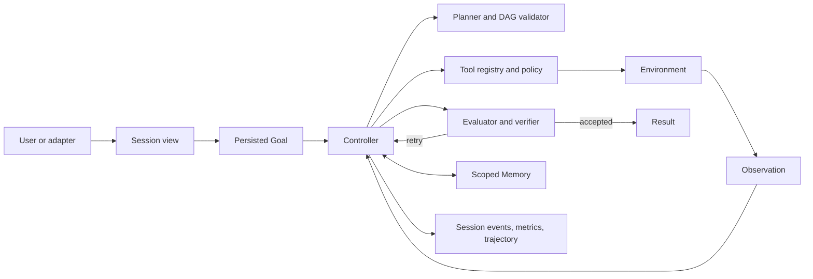

# Paper Agent Architecture

[English](architecture.md) | [简体中文](architecture.zh-CN.md)

A useful agent is a state machine, a permission system, and an evidence pipeline
around a model. Paper Agent keeps those responsibilities explicit so each can
be inspected and replaced without granting the model authority over the host.


## System Boundary



The model can propose a plan, tool call, or final result. The host owns schema
validation, execution, permissions, cancellation, persistence, and acceptance.

## Model Provider

`internal/provider` abstracts model transport from controller behavior. The
OpenAI-compatible implementation uses the Responses API, supports SSE streaming,
custom base URLs, bounded retry, a model fallback chain, prompt-cache keys, and
usage accounting. Provider output is never accepted as an executable object
until `internal/model` parses it into the expected decision schema.

The deterministic `DemoModel` implements the same planning and decision
interfaces. It makes state, policy, and failure tests independent of network
availability or model drift.

## Controller and Goal Continuation

The controller runs two nested loops:

- Within one Goal turn, a bounded ReAct loop performs
  `Decide -> Tool -> Observation`.
- Across turns, the persisted Goal continues when the evaluator has not yet
  accepted the result.

Cancellation, pause, evaluator success, explicit budgets, and unrecoverable
errors stop the outer loop. Token and Goal-turn limits default to zero, meaning
unlimited, while `max-steps` still bounds each inner turn.

Goal state lives in `goals.db`, not in a chat message. It records identity,
status, accumulated tokens and turns, pause/resume/clear transitions, and
whether a future request may auto-resume it.

## Planning

The planner returns structured steps containing IDs, descriptions,
dependencies, tools, roles, success criteria, status, and acceptance checks.
`planning.Validator` rejects missing or duplicate IDs, unknown dependencies,
cycles, unavailable tools, invalid initial state, and empty success criteria.

Validated plans are persisted in `plans.db`. The scheduler only runs steps whose
dependencies are complete and can execute independent roles concurrently.
Deterministic verifiers inspect file or output evidence. A human acceptance
check moves a step to `awaiting_acceptance` until CLI or HTTP approval arrives.
Process restart does not turn a persisted plan back into prose.

## Tool Layer

The registry exposes the following built-in capability groups:

- paper catalog lookup and paper-card reading
- workspace file read, write, edit, list, glob, and grep
- bounded shell execution
- web fetch and search
- explicit user clarification
- a bounded subagent capability
- configured command plugins and MCP stdio tools

Every definition includes a schema and a read, write, or dangerous risk level.
The registry applies an allowlist, argument validation, approval policy, timeout,
serialized output limit, and metrics. Write and dangerous tools require
approval by default. Plugins and MCP tools default to dangerous.

File operations reject workspace and symbolic-link escape. Web operations
reject loopback, private, and link-local targets and unsafe redirects. These
checks are part of a defense in depth model; production deployments still need
OS/process sandboxing, network policy, and narrow credentials.

## Session and Context

`sessions.db` stores complete user/assistant messages plus structured runtime
events. A session can be listed, titled, inspected, and forked. Full history is
never deleted by compaction.

The model-facing view is reduced in layers:

1. L1 micro-compaction removes repetition and oversized detail from old turns.
2. L2 creates a deterministic digest of goals, outcomes, failures, and URLs.
3. L3 asynchronously prewarms a semantic model summary at 75% of the configured
   threshold and falls back to L2 on timeout or failure.

When the provider reports a context-length error, the caller retries with one
recent turn and then only the current turn. The Session layer and the Agent
Loop's recent-observation summary solve different horizons and remain separate.

## Memory

Long-term memory lives in `memory.db`. A record has a scope, key, value, source,
confidence, lifecycle status, and creation/update/use timestamps. `(scope, key)`
is unique, so stable facts are revised instead of appended forever. Retrieval
applies both item-count and byte budgets and ranks candidates by scope,
relevance, confidence, and recency.

Obvious secrets are rejected before write. Retrieved content is still evidence,
not permission. Future work includes explicit candidate confirmation, conflict
merging, expiry rules, and richer deletion/audit interfaces.

## Evaluation and Acceptance

The report evaluator checks deterministic content requirements before a Goal is
completed. Plan steps can additionally require file/output evidence or explicit
human acceptance. The model that generated a result is therefore not the only
judge of completion.

This boundary should become more domain-specific in downstream agents: tests
for code, environment state for operations, citations for research, or a human
decision for irreversible actions.

## Observability and Persistence

```text
.agent-data/
├── sessions.db
├── goals.db
├── plans.db
├── memory.db
├── metrics.db
└── runs/<run-id>.jsonl
```

Trajectories retain the complete `goal -> plan -> decisions -> tools ->
observations -> evaluation -> result` event stream with sensitive fields
redacted. Metrics record model calls, input/output/cache tokens, latency, tool
calls and failures, approvals, compactions, Goal turns, and outcome. Session L3
summary usage is recorded separately in `sessions.db`.

## Interfaces

All user surfaces reuse the same runtime semantics:

- one-shot CLI
- persistent readline UI with history and search
- Markdown terminal rendering and full-screen TUI
- Web UI over the asynchronous HTTP task API and SSE events
- Feishu callback sidecar with durable chat/session mapping, images, quoting,
  cancellation, and approval cards

Adapters do not receive LLM credentials and cannot bypass the runtime tool
policy.

## Trust Model

| Input or component | Default trust |
| --- | --- |
| Host configuration and compiled policy | trusted within the deployment boundary |
| Model plan or tool request | untrusted proposal |
| Web, RAG, quoted messages, and tool output | untrusted data |
| Long-term memory | provenance-bearing evidence, not authorization |
| Plugin or MCP process | dangerous capability requiring operator trust |
| Human acceptance | authorization for the exact pending action, not future actions |

The architecture is intentionally conservative: flexibility stays in the model,
while side effects and completion remain visible to deterministic code.
