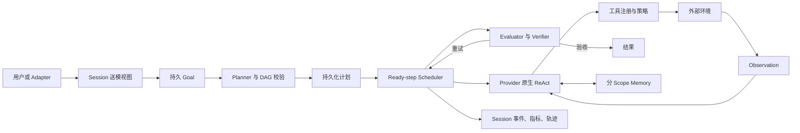

# Your Agent 架构

[English](architecture.md) | [简体中文](architecture.zh-CN.md)

一个可用的 Agent 是围绕模型建立的状态机、权限系统和证据链。Your Agent 代表由用户掌握、可高度定制的专属 Agent Runtime；它把这些职责显式拆开，使每层都能独立检查和替换，模型本身不直接获得宿主权限。

## 系统边界

模型可以提出计划、工具调用或最终结果；宿主程序拥有 schema 校验、执行、权限、取消、持久化和验收权。

## Model Provider

`internal/provider` 将模型传输与 Agent 行为隔离。OpenAI-compatible 实现使用 Responses API，支持 SSE 流式输出、自定义 Base URL、有限重试、模型回退链、Prompt Cache Key 和 usage 统计。工具通过 Provider 原生 function-call schema 暴露，结果携带原 call ID 回送模型；原生工具调用仍是不可信提议，必须由宿主校验和授权。

流恢复有明确的副作用边界：上游 SSE 只有在尚未输出语义时才会重试；已经完成的 `output_item.done` block 可以无重放挽救，合法工具调用只执行一次，结果写入原生历史，再追加“不重复已完成工作”的 user continuation。残缺 block 和非法参数会被丢弃而不是猜测。面向浏览器的 HTTP SSE 使用独立事件游标，客户端重连只补发当前任务消息，不会重新运行模型。

确定性的 `DemoModel` 实现同一套计划与原生 turn 接口，使状态、权限和失败测试不依赖网络和模型漂移。

## Scheduler、ReAct 与 Goal Continuation

运行时包含三个协作循环：Scheduler 从持久 DAG 中选择依赖已完成的步骤并并发调度独立角色；每个步骤内部执行有界的 Provider 原生 `assistant tool_call -> 宿主执行 -> tool_result -> 模型` ReAct；Evaluator 未通过时，外层继续同一个持久 Goal。取消、暂停、验收成功、显式预算和不可恢复错误会停止任务。`token-budget=0` 与 `goal-turns=0` 默认表示不限，`max-steps` 限制每个计划步骤中的模型 turn 数。

Goal 独立保存在 `goals.db`，记录身份、状态、累计 Token 和轮次、pause/resume/clear 历史以及是否允许自动恢复，而不是伪装成一条聊天消息。同一个 assistant turn 内，只有显式声明支持并行且风险为 `read` 的工具可以重叠；concurrency lane 串行化冲突读，写入和危险工具始终串行，结果按 Provider 原 call 顺序组装。独立子 Agent Runtime 使用相同规则。

## Planning

计划步骤包含 ID、描述、依赖、受控 `allowedTools` 集合、角色、成功条件、状态和验收检查。Validator 拒绝重复 ID、未知依赖、依赖环、不可用工具、过大的工具集合、非法初始状态和空成功条件。为兼容已有持久计划，旧的单数 `tool` 字段会被归一化到 `allowedTools`。

合法计划写入 `plans.db`。Scheduler 只运行依赖已完成的步骤，并可并行执行独立角色。确定性 Verifier 检查文件或输出证据；需要人工检查的步骤进入 `awaiting_acceptance`，等待 CLI 或 HTTP 验收。`/plan resume <id>` 会加载该计划，把中断遗留的 `running` 步骤恢复为 `pending`，再交回 Scheduler；不会重新规划、转成文本，也不会重复已完成步骤。

## Tool Layer

内置能力包括论文目录、工作区文件读写编辑、目录和 glob/grep、本地语义符号搜索、Shell、网页抓取与搜索、用户澄清、Markdown Skills、持久化子 Agent，以及配置的命令插件和 MCP stdio 工具。

每个工具都有 schema 与只读、写入或危险等级。Registry 统一执行 allowlist、参数校验、审批、超时、输出字节预算和指标记录。写入与危险工具默认需要审批；插件和 MCP 默认标记为危险。文件工具拒绝工作区及符号链接逃逸；网页工具拒绝回环、私网、链路本地地址和不安全重定向。生产环境仍需 OS 沙箱、网络策略和最小权限凭据。

Skills 使用 YAML frontmatter、依赖检查、单文件限制和总 Prompt 预算，可从仓库、项目和用户目录加载。语义代码搜索只在本地对有界源码建立符号/词法索引并返回带行号证据，不假装是远程向量服务。子 Agent 写入 `subagents.db`，保存稳定 ID、父 Session/Run、超时、取消、结果、错误以及重启中断状态，并通过 `spawn/status/wait/cancel/list` 管理生命周期。每个子 Agent 还拥有独立的 Provider 原生消息历史和有界 ReAct 循环，继承 Runtime Registry 与权限策略，可在授权工具集合内组合调用并保留原生 call/result 配对；默认排除递归创建子 Agent。

## Session 与上下文

`sessions.db` 不是一份文本聊天记录，而是有序的 canonical event store。`session_turns` 定义恢复边界，`session_turn_events` 保存消息、Runtime、指标和终态事件，`session_messages` 与 `session_turn_metrics` 是查询投影。Agent 运行期间先在内存缓冲整个 turn，结束时用一个 SQLite 事务同时提交所有投影；提交失败不会留下半截 tool protocol 或虚假的成功指标。

消息保留 Provider 无关的原生 block：文本与图片、Provider reasoning ID 及 encrypted/raw 状态、工具名称与参数、tool-call ID、tool result、错误和最终 assistant 文本。恢复时重建的仍是 `user -> assistant_blocks -> tool_results -> assistant` 结构，并作为原生 Responses items 交给 Provider，而不是把工具调用和 reasoning 拼成文本回放。送模前会剔除失去配对的 call/result；旧文本 Session 会迁移为已完成的 canonical turn，Fork 也会生成独立的结构化 turn 历史。失败、取消和超时 turn 会完整保留为 canonical 审计事件，但默认不进入可续接历史；只有调用方确认工具协议完整时才显式保留。

Session 支持列表、标题、状态、Fork 和删除，并通过 REST API 分别暴露结构化消息与 canonical events；状态提供最后一轮状态，以及累计 Token、工具、失败、耗时和成功指标。压缩只改变送模视图，不删除历史：L0 将超过 16 KB 的旧 tool result 缩为 4 KB 头尾并保护最新结果，同时限制重复和超大旧文本；L1 将相同工具与参数的更早结果替换为 superseded 标记，但保留 call/result 身份；L2 只在普通 user text/image 边界裁剪并生成保留目标、结论、失败和 URL 的确定性 digest；L3 在 OpenAI 模式下于阈值 75% 异步预热语义摘要，只使用覆盖范围足够的结果，失败或超时立即退回 L2。

每次 ReAct 模型调用前也执行 L0/L1。Provider 仍返回 context-length 错误时，当前步骤依次缩到最近一轮和 0 个历史轮次；已完成工具及其原生 ID 不会被重启。Session 跨用户轮次压缩与 Agent Loop 内 observation 摘要服务不同时间跨度，彼此独立。

## Memory

长期记忆保存在 `memory.db`。记录包含 scope、key、value、source、confidence、生命周期状态以及创建、更新、使用时间。`(scope, key)` 唯一，稳定事实会更新而不是无限追加。检索同时受条数和字节预算约束，并按 scope、相关性、置信度和时间排序。

明显密钥会被拒绝写入；召回内容仍是证据，不是权限。候选确认、冲突合并、过期和更完整的删除审计是后续方向。

## Evaluation、可观测性与接口

Evaluator 用确定性规则检查报告，计划步骤还可要求文件/输出证据或人工验收。发生文件写入或编辑后，宿主 Verification Gate 会阻止计划直接完成，必要时追加持久化验证步骤；只有真实观察到测试、构建、Lint 或等价命令成功才放行，伪造“已验证”文本会安全失败。每次运行保存脱敏 JSONL 轨迹，以及模型调用、输入输出和 Cache Token、延迟、工具调用与失败、审批、压缩、Goal 轮次和成功结果等指标。

一次性 CLI、readline、Markdown 终端、全屏 TUI、Web UI、异步 HTTP API 和飞书 sidecar 复用同一套状态和权限语义。Web UI 还使用持久化 `tasks.db`、Session REST、工作区文件 API 和带同源校验的 WebSocket PTY。HTTP 主链使用带全局与单 Session 上限的有界 Worker Queue：不同 Session 可并发，同一 Session 严格串行；任务消息带单调递增 SSE ID，可通过 `Last-Event-ID` 或 `after` 游标续流。服务重启时 queued/running 等未完成任务明确转为 `interrupted`，不会隐式重放。Adapter 不持有 LLM 凭据，也不能绕过 Tool Registry。

## 信任模型

| 输入或组件 | 默认信任等级 |
| --- | --- |
| 宿主配置与编译策略 | 在部署边界内可信 |
| 模型计划或工具请求 | 不可信提议 |
| 网页、RAG、引用消息、工具输出 | 不可信数据 |
| 长期记忆 | 带来源的证据，不是授权 |
| 插件或 MCP 进程 | 需要操作者信任的危险能力 |
| 人工验收 | 只授权当前待审批动作，不授权未来动作 |

这套架构刻意保持保守：推理灵活性留在模型中，副作用和完成判断留在可验证的代码中。
