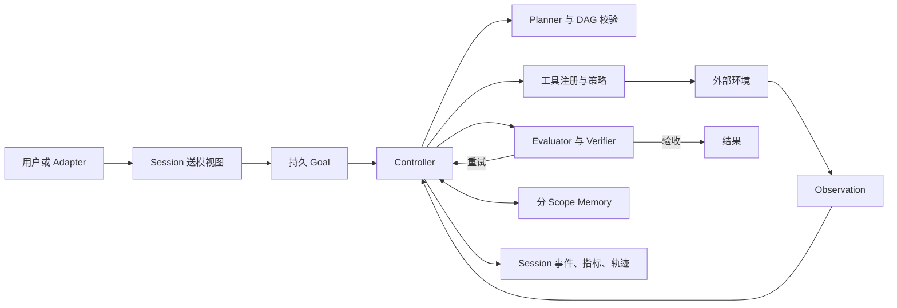

# Paper Agent 架构

[English](architecture.md) | [简体中文](architecture.zh-CN.md)

一个可用的 Agent 是围绕模型建立的状态机、权限系统和证据链。Paper Agent 把这些职责显式拆开，使每层都能独立检查和替换，模型本身不直接获得宿主权限。

## 系统边界

模型可以提出计划、工具调用或最终结果；宿主程序拥有 schema 校验、执行、权限、取消、持久化和验收权。

## Model Provider

`internal/provider` 将模型传输与 Controller 行为隔离。OpenAI-compatible 实现使用 Responses API，支持 SSE 流式输出、自定义 Base URL、有限重试、模型回退链、Prompt Cache Key 和 usage 统计。`internal/model` 必须先把文本解析成约定的结构化决策，之后仍要经过本地校验。

确定性的 `DemoModel` 实现同一套计划与决策接口，使状态、权限和失败测试不依赖网络和模型漂移。

## Controller 与 Goal Continuation

运行时有两层循环：单个 Goal turn 内执行有步数边界的 `Decide -> Tool -> Observation`；Evaluator 未通过时，外层继续同一个持久 Goal。取消、暂停、验收成功、显式预算和不可恢复错误会停止任务。`token-budget=0` 与 `goal-turns=0` 默认表示不限，但每个 turn 仍由 `max-steps` 约束。

Goal 独立保存在 `goals.db`，记录身份、状态、累计 Token 和轮次、pause/resume/clear 历史以及是否允许自动恢复，而不是伪装成一条聊天消息。

## Planning

计划步骤包含 ID、描述、依赖、工具、角色、成功条件、状态和验收检查。Validator 拒绝重复 ID、未知依赖、依赖环、不可用工具、非法初始状态和空成功条件。

合法计划写入 `plans.db`。Scheduler 只运行依赖已完成的步骤，并可并行执行独立角色。确定性 Verifier 检查文件或输出证据；需要人工检查的步骤进入 `awaiting_acceptance`，等待 CLI 或 HTTP 验收。进程重启后继续的是结构化状态，不是让模型凭自然语言回忆。

## Tool Layer

内置能力包括论文目录、工作区文件读写编辑、目录和 glob/grep、Shell、网页抓取与搜索、用户澄清、子 Agent，以及配置的命令插件和 MCP stdio 工具。

每个工具都有 schema 与只读、写入或危险等级。Registry 统一执行 allowlist、参数校验、审批、超时、输出字节预算和指标记录。写入与危险工具默认需要审批；插件和 MCP 默认标记为危险。文件工具拒绝工作区及符号链接逃逸；网页工具拒绝回环、私网、链路本地地址和不安全重定向。生产环境仍需 OS 沙箱、网络策略和最小权限凭据。

## Session 与上下文

`sessions.db` 保存完整消息和结构化 Runtime 事件，支持列表、标题、状态和 Fork。压缩只改变送模视图，不删除历史：L1 压缩旧消息中的重复或超大细节；L2 生成保留目标、结论、失败和 URL 的确定性 digest；L3 在 OpenAI 模式下于阈值 75% 异步预热语义摘要，失败或超时立即退回 L2。

Provider 仍返回 context-length 错误时，运行时依次缩到最近一轮和仅当前轮。Session 跨用户轮次压缩与 Agent Loop 内 observation 摘要服务不同时间跨度，彼此独立。

## Memory

长期记忆保存在 `memory.db`。记录包含 scope、key、value、source、confidence、生命周期状态以及创建、更新、使用时间。`(scope, key)` 唯一，稳定事实会更新而不是无限追加。检索同时受条数和字节预算约束，并按 scope、相关性、置信度和时间排序。

明显密钥会被拒绝写入；召回内容仍是证据，不是权限。候选确认、冲突合并、过期和更完整的删除审计是后续方向。

## Evaluation、可观测性与接口

Evaluator 用确定性规则检查报告，计划步骤还可要求文件/输出证据或人工验收。每次运行保存脱敏 JSONL 轨迹，以及模型调用、输入输出和 Cache Token、延迟、工具调用与失败、审批、压缩、Goal 轮次和成功结果等指标。

一次性 CLI、readline、Markdown 终端、全屏 TUI、Web UI、异步 HTTP API 和飞书 sidecar 复用同一套状态和权限语义。Adapter 不持有 LLM 凭据，也不能绕过 Tool Registry。

## 信任模型

| 输入或组件 | 默认信任等级 |
| --- | --- |
| 宿主配置与编译策略 | 在部署边界内可信 |
| 模型计划或工具请求 | 不可信提议 |
| 网页、RAG、引用消息、工具输出 | 不可信数据 |
| 长期记忆 | 带来源的证据，不是授权 |
| 插件或 MCP 进程 | 需要操作者信任的危险能力 |
| 人工验收 | 只授权当前待审批动作，不授权未来动作 |

这套架构刻意保持保守：推理灵活性留在模型中，副作用和完成判断留在可验证的代码中。
