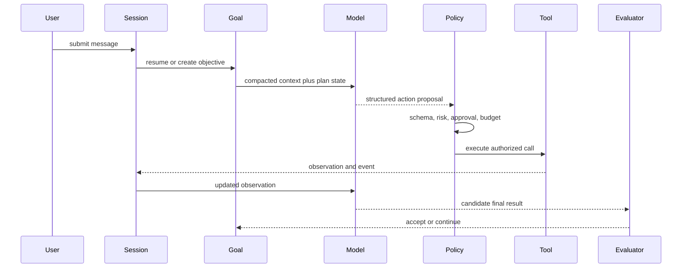

# Paper Agent Engineering Implementation

[English](engineering-practice.md) | [简体中文](engineering-practice.zh-CN.md)

`examples/paper-agent` is where the research map becomes executable code. The
current implementation is no longer a two-tool demo: it is a compact agent
runtime with a real provider, controlled host capabilities, durable state,
multiple user interfaces, and release regression.

## Capability Snapshot

| Concern | Research question | Current implementation |
| --- | --- | --- |
| Agent Loop | How does reasoning become continued action? | bounded ReAct within a persisted Goal continuation loop |
| Provider | How can models change without rewriting the controller? | OpenAI-compatible Responses API, SSE, fallback, retry, cache and usage metrics; deterministic demo provider |
| Tools | Who is allowed to affect the environment? | file, shell, search, web, clarification, subagent, plugin, and MCP tools behind schemas and policy |
| Session | How is a conversation resumed without replaying everything? | SQLite messages/events plus layered model-facing compaction |
| Goal | How does one objective survive turns and restarts? | independent lifecycle with pause, resume, clear, auto-resume, tokens and turns |
| Planning | How is a plan recovered and verified? | validated and persisted DAG, dependency scheduler, role concurrency, verifier, human acceptance |
| Memory | What becomes durable cross-task knowledge? | scoped SQLite records with provenance, confidence, status, upsert, and retrieval budgets |
| Evaluation | When is the task actually done? | deterministic report checks and evidence-bearing plan acceptance |
| Observability | Can cost and failure be compared? | JSONL trace, run metrics, cumulative success rate, summary usage |
| Delivery | Can users exercise the same behavior through real surfaces? | CLI/readline/TUI/Web/Feishu, E2E, browser tests, cross-platform archives and checksums |

## Execution Path



The central engineering rule is visible in the sequence: the model proposes;
the host validates, executes, persists, and judges.

## 1. Provider and Structured Decisions

`internal/provider/openai.go` owns HTTP and SSE details. It parses streamed text,
collects final usage, records prompt-cache read/create tokens, retries transient
429/5xx failures, and advances through a configured fallback model chain. API
keys stay in the environment and `store=false` keeps runtime state local.

`internal/model/openai.go` turns provider text into one of two contracts: a plan
or a controller decision. Parsing success is only the first gate. Plan and tool
validators still reject structurally invalid or unauthorized output.

Custom OpenAI-compatible gateways omit optional `max_output_tokens` because
some gateways reject it. The runtime retains a response-body limit; operators
should also configure output limits on their gateway.

## 2. Tool Use as a Permission Boundary

The registry separates tool selection from execution. Every invocation passes:

1. registration and allowlist lookup
2. argument schema validation
3. risk classification
4. approval policy
5. timeout and cancellation
6. output serialization and byte budget
7. observation and metric recording

The runtime now includes real file, shell, grep/glob, web, clarification, and
subagent capabilities in addition to paper-card tools. `.paper-agent/plugins.json`
can register command plugins and MCP stdio servers. External tools are marked
dangerous by default, so adding a tool does not silently grant it authority.

This is the runtime interpretation of Toolformer: a model can learn when and
how to call a tool, while the operating system boundary remains host-owned.

## 3. Four Kinds of Durable State

Paper Agent deliberately avoids treating every persistent object as memory:

- **Session** owns complete conversational messages and structured events.
- **Goal** owns the long-running objective and continuation lifecycle.
- **Plan** owns recoverable execution steps, dependencies, evidence, and
  acceptance.
- **Memory** owns selected facts that remain useful across tasks.

Metrics and replay traces form a fifth, observational plane. This split prevents
chat history from becoming an authorization source and prevents an execution
plan from disappearing when context is compressed.

## 4. Context Compaction Without Data Loss

Session compaction is a view operation. Full messages stay in SQLite. At the
configured byte or token threshold, the view keeps recent user turns and adds a
deterministic digest for older goals, conclusions, failures, and URLs. In OpenAI
mode, the store prewarms a semantic summary in the background at 75% of the
threshold. A 12-second hard timeout and deterministic fallback keep summary
generation out of the user request's critical path.

The provider error path adds two recovery levels: one recent turn, then only the
current request. Summary calls, input/output tokens, and latency are persisted
so the apparent context savings can be evaluated against summary cost.

Within one Goal, `recentObservations` and `contextSummary` provide a separate
working-memory boundary. This mirrors HiAgent's hierarchy while preserving the
original trace for audit and later analysis.

## 5. Goal and Planning Recovery

An unfinished objective is not reconstructed from the latest prompt. `goals.db`
retains its identity, state, token use, turn count, and transition history.
Users can pause, resume, clear, or inspect it through CLI and HTTP. Default zero
budgets are unlimited, which supports continuation until evaluation or explicit
operator control stops the task.

Plans are validated before persistence. The DAG scheduler runs only ready
steps, supports concurrent independent roles, and records attempt/evidence
updates. Deterministic verifiers inspect outputs; steps with human checks enter
`awaiting_acceptance`. Restarting a process therefore resumes structured state
rather than asking the model to remember what happened.

## 6. Memory Lifecycle

The old JSON memory has been replaced by SQLite. Records carry scope, source,
confidence, active/archived status, and timestamps. Upsert semantics revise a
stable `(scope, key)` instead of appending duplicates. Retrieval applies item
and byte budgets and ranks by scope, query relevance, confidence, and recency.

The current store rejects obvious credentials. It still treats retrieved memory
as untrusted evidence, following AgentPoison's warning that persistent retrieval
can become a delayed attack surface. Candidate confirmation, conflict merging,
expiry, and richer user deletion remain future work.

## 7. Evaluation, Metrics, and Traces

The deterministic report evaluator checks required sections and source links.
Plan verification adds file/output evidence and optional human acceptance. A
model's final message alone cannot mark the Goal achieved.

Each run writes redacted JSONL events and a metrics row containing outcome,
duration, LLM calls, token usage, prompt-cache tokens, tool calls/failures/time,
approvals, compactions, and Goal turns. The CLI reports cumulative task success
from prior runs. These records are the prerequisite for fixed-task comparison,
preference data, skill extraction, or RL; they are not themselves a training
pipeline.

## 8. User Surfaces and Adapters

The same state and policy are exposed through:

- one-shot CLI
- readline with persistent history, completion, and `Ctrl+R` search
- Markdown terminal output and a full-screen TUI
- an embedded Web UI over asynchronous HTTP tasks and SSE events
- a Feishu sidecar for text, rich text, quoted messages, images, chat/session
  mapping, cancellation, and interactive approval cards

The Feishu process owns platform credentials and mapping state. The Agent Server
owns LLM credentials, tools, goals, plans, and sessions. The adapter does not
weaken the runtime permission checks.

## 9. Verification and Release

```bash
npm test
npm run papers:verify
make build
make e2e
make browser-regression
make open-source-check
make release-snapshot
make verify-release
```

The test suite covers provider streaming, fallback, prompt cache and usage;
structured plan and tool validation; approval, timeout, output limits, workspace
and web boundaries; SQLite migration and lifecycle behavior; L1/L2/L3 session
compaction and fallback; Goal continuation; plan scheduling and acceptance;
HTTP/Feishu state; metrics; and UI behavior. GitHub Actions build Linux, macOS,
and Windows artifacts. Version tags produce archives, SHA-256 checksums, and
keyless Cosign signatures when the release workflow is enabled.

## Honest Limits

The implementation demonstrates reusable runtime mechanisms, but it is not yet
a general paper-research product or a hardened multi-tenant service. PDF text
extraction, citation entailment, browser automation, memory conflict resolution,
tenant isolation, encrypted Feishu callbacks, and production sandboxing need
additional work. RL should wait until a stable task set, reward definition, and
high-quality trace corpus exist.
