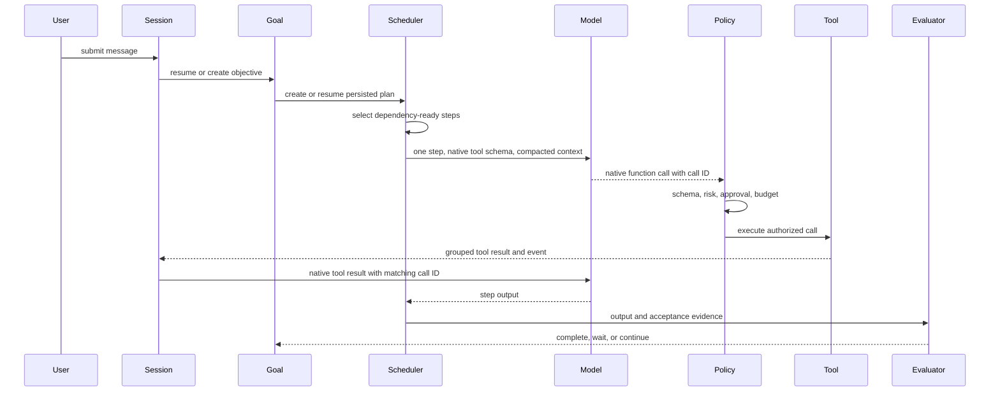

# Your Agent Engineering Implementation

[English](engineering-practice.md) | [简体中文](engineering-practice.zh-CN.md)

`examples/your-agent` is where the research map becomes executable code. The
current implementation is no longer a two-tool demo: it is a compact agent
runtime with a real provider, controlled host capabilities, durable state,
multiple user interfaces, and release regression.

## Capability Snapshot

| Concern | Research question | Current implementation |
| --- | --- | --- |
| Agent Loop | How does reasoning become continued action? | scheduler-owned ready-step execution with provider-native ReAct inside each step |
| Provider | How can models change without rewriting the runtime? | OpenAI-compatible Responses API, native tool calling, SSE, bounded interruption recovery, fallback, cache and usage metrics; deterministic demo provider |
| Tools | Who is allowed to affect the environment? | per-step controlled tool sets; file, shell, semantic code search, web, clarification, Skills, tool-enabled subagents, plugins, and MCP behind schemas and policy |
| Session | How is a conversation resumed without replaying everything? | SQLite messages/events plus layered model-facing compaction |
| Goal | How does one objective survive turns and restarts? | independent lifecycle with pause, resume, clear, auto-resume, tokens and turns |
| Planning | How is a plan recovered and verified? | validated and persisted DAG, dependency scheduler, role concurrency, verifier, human acceptance |
| Memory | What becomes durable cross-task knowledge? | scoped SQLite records with provenance, confidence, status, upsert, and retrieval budgets |
| Evaluation | When is the task actually done? | deterministic report checks, evidence-bearing plan acceptance, and a host-owned Verification Gate |
| Observability | Can cost and failure be compared? | JSONL trace, run metrics, cumulative success rate, summary usage |
| Delivery | Can users exercise the same behavior through real surfaces? | CLI/readline/TUI, bounded HTTP queue, resumable SSE, Session/task REST, file workbench, WebSocket PTY, Feishu, E2E, browser tests, and cross-platform releases |

## Execution Path



The central engineering rule is visible in the sequence: the model proposes;
the host validates, executes, persists, and judges.

## 1. Provider-Native Tool Calling

`internal/provider/openai.go` owns HTTP and SSE details. It parses streamed text,
collects final usage, records prompt-cache read/create tokens, retries transient
429/5xx failures, and advances through a configured fallback model chain. API
keys stay in the environment and `store=false` keeps runtime state local.

An asynchronous SSE interruption is retried only before semantic output. Once
the provider has emitted complete `output_item.done` blocks, the runtime can
salvage those blocks without replaying the request. Complete tool calls execute
once, matching results are recorded, and a persisted native user continuation
asks the model to continue without repeating successful work. Partial blocks or
malformed arguments fail closed.

`internal/model/openai.go` still asks the model for a structured plan, which is
parsed and validated before persistence. Step execution no longer asks for a
JSON controller decision: tools are sent through the Responses API native tool
schema, assistant tool-call blocks are preserved, and grouped tool-result blocks
are returned with their original call IDs. Tool Registry authorization remains
the execution gate.

Custom OpenAI-compatible gateways omit optional `max_output_tokens` because
some gateways reject it. The runtime retains a response-body limit; operators
should also configure output limits on their gateway.

## 2. Tool Use as a Permission Boundary

The registry separates tool selection from execution. Every invocation passes:

1. registration and allowlist lookup
2. argument schema validation
3. risk classification
4. approval policy
5. timeout and cancellation
6. output serialization and byte budget
7. observation and metric recording

The runtime now includes real file, shell, grep/glob, bounded local semantic
symbol search, web, clarification, Skills, and durable subagent capabilities in
addition to paper-card tools. `.your-agent/plugins.json`
can register command plugins and MCP stdio servers. External tools are marked
dangerous by default, so adding a tool does not silently grant it authority.

This is the runtime interpretation of Toolformer: a model can learn when and
how to call a tool, while the operating system boundary remains host-owned.

Skills are Markdown plus YAML frontmatter loaded from repository, project, or
user scope under dependency and prompt-size budgets. Subagents have stable IDs,
parent Session/Run IDs, timeout/cancel state, and persisted results rather than
being anonymous one-shot model calls. Each child owns a separate native message
history and bounded ReAct runtime, uses the shared registry and policy to select
from its authorized tools, and preserves call/result IDs. Recursive child
spawning is disabled by default.

Parallel execution is an explicit tool capability, not a model privilege. Only
`read` tools can use it. Calls sharing a concurrency lane remain serial; other
read lanes may overlap. The executor reserves result slots before starting work,
so the next native `tool_results` message follows provider-call order even when
completion order differs. Write, dangerous, and child-lifecycle calls remain
serial.

## 3. Durable State Has Multiple Owners

Your Agent deliberately avoids treating every persistent object as memory:

- **Session** owns canonical turns, native content blocks, tool protocol,
  terminal state, and per-turn metrics.
- **Goal** owns the long-running objective and continuation lifecycle.
- **Plan** owns recoverable execution steps, dependencies, evidence, and
  acceptance.
- **Memory** owns selected facts that remain useful across tasks.
- **Task** owns asynchronous HTTP execution, approval, stream messages, result,
  and restart interruption state.
- **Subagent** owns child identity, parentage, lifecycle, result, and failure.

Metrics and replay traces form a fifth, observational plane. Session metrics are
committed with their turn, while cross-run metrics and redacted JSONL remain
separate analytical projections. This split prevents chat history from becoming
an authorization source and prevents an execution plan from disappearing when
context is compressed.

One user turn is the Session transaction boundary. The runtime buffers user
blocks, assistant reasoning, tool calls and matching results, the final answer,
status, and metrics; then writes the turn and every projection atomically.
Restoration reads native blocks, preserves provider reasoning payloads and
tool-call IDs, repairs invalid call/result adjacency, and passes structured
items back to the provider. The human-readable transcript is only a display
projection, never the source used to continue a conversation.

## 4. Context Compaction Without Data Loss

Session compaction is a view operation. Full native blocks stay in SQLite. L0
reduces old tool results above 16 KB to a 4 KB head and tail while exempting the
newest result. L1 replaces an earlier result from the same tool and canonical
arguments with a compact superseded marker, without removing either call ID or
result block. L2 cuts only at a plain user text/image boundary, keeps recent
turns and intact tool protocol, and adds a deterministic digest for older goals,
conclusions, failures, and URLs. L3 prewarms a semantic summary in the background
at 75% of the threshold, has a 12-second timeout, and is consumed only when it
covers the whole discarded prefix.

L0/L1 are also applied to the local native history before every ReAct model
call. A context-length error is recovered inside the same scheduled step with
one recent turn and then no historical turns. This does not restart the step or
repeat completed tools. Summary calls, input/output tokens, and latency are
persisted so the apparent context savings can be evaluated against summary cost.

Within one Goal, `recentObservations` and `contextSummary` provide a separate
working-memory boundary. This mirrors HiAgent's hierarchy while preserving the
original trace for audit and later analysis.

## 5. Goal and Planning Recovery

An unfinished objective is not reconstructed from the latest prompt. `goals.db`
retains its identity, state, token use, turn count, and transition history.
Users can pause, resume, clear, or inspect it through CLI and HTTP. Default zero
budgets are unlimited, which supports continuation until evaluation or explicit
operator control stops the task.

Plans are validated before persistence. The DAG scheduler runs only ready
steps, supports concurrent independent roles, and records attempt/evidence
updates. Deterministic verifiers inspect outputs; steps with human checks enter
`awaiting_acceptance`. Restarting a process therefore resumes structured state
rather than asking the model to remember what happened.

The scheduler is also the main execution path, not an inspection-only helper.
Each ready step receives a bounded native ReAct loop scoped to that step's
controlled `allowedTools` set. The model may compose multiple tools within one
step, but every call is checked against that set. Legacy single-tool plans are
normalized during validation. `/plan resume <id>` loads the same plan, recovers
interrupted `running` steps to `pending`, and calls the scheduler again without
creating a replacement plan or repeating completed steps.

## 6. Memory Lifecycle

The old JSON memory has been replaced by SQLite. Records carry scope, source,
confidence, active/archived status, and timestamps. Upsert semantics revise a
stable `(scope, key)` instead of appending duplicates. Retrieval applies item
and byte budgets and ranks by scope, query relevance, confidence, and recency.

The current store rejects obvious credentials. It still treats retrieved memory
as untrusted evidence, following AgentPoison's warning that persistent retrieval
can become a delayed attack surface. Candidate confirmation, conflict merging,
expiry, and richer user deletion remain future work.

## 7. Evaluation, Metrics, and Traces

The deterministic report evaluator checks required sections and source links.
Plan verification adds file/output evidence and optional human acceptance. A
model's final message alone cannot mark the Goal achieved.

After material file work, the host-owned Verification Gate requires an observed
successful test, build, lint, or equivalent command. It can append a persisted
verification step and fails closed if a plan only claims verification in text.

Each run writes redacted JSONL events and a metrics row containing outcome,
duration, LLM calls, token usage, prompt-cache tokens, tool calls/failures/time,
approvals, compactions, and Goal turns. The CLI reports cumulative task success
from prior runs. These records are the prerequisite for fixed-task comparison,
preference data, skill extraction, or RL; they are not themselves a training
pipeline.

## 8. User Surfaces and Adapters

The same state and policy are exposed through:

- one-shot CLI
- readline with persistent history, completion, and `Ctrl+R` search
- Markdown terminal output and a full-screen TUI
- an embedded Web workbench over persistent tasks, SSE, Session REST, workspace
  file APIs, and a same-origin WebSocket PTY
- a Feishu sidecar for text, rich text, quoted messages, images, chat/session
  mapping, cancellation, and interactive approval cards

The Feishu process owns platform credentials and mapping state. The Agent Server
owns LLM credentials, tools, goals, plans, and sessions. The adapter does not
weaken the runtime permission checks.

The Agent Server places requests in a bounded worker queue. Different Sessions
can execute concurrently, but one Session is serialized so two HTTP requests
cannot race its canonical turn history. Global pending, per-Session, and active
worker limits provide backpressure. SSE messages carry monotonic IDs; clients
resume with `Last-Event-ID` or `after=N`, while restart recovery marks unfinished
durable tasks `interrupted` instead of executing them twice.

## 9. Verification and Release

```bash
npm test
npm run papers:verify
make build
make e2e
make browser-regression
make open-source-check
make release-snapshot
make verify-release
```

The test suite covers provider streaming, complete-block interruption salvage,
ordered parallel read tools, truncated-turn continuation, fallback,
prompt cache and usage; controlled plan tool sets; approval, timeout, output limits, workspace
and web boundaries; SQLite migration and lifecycle behavior; L0/L1/L2/L3 session
compaction and fallback; Goal continuation; plan scheduling and acceptance;
HTTP queue concurrency, SSE cursors, Feishu state; metrics; and UI behavior. GitHub Actions build Linux, macOS,
and Windows artifacts. Version tags produce archives, SHA-256 checksums, and
keyless Cosign signatures when the release workflow is enabled.

## Honest Limits

The implementation demonstrates reusable runtime mechanisms, but it is not yet
a general paper-research product or a hardened multi-tenant service. PDF text
extraction, citation entailment, browser automation, memory conflict resolution,
tenant isolation, encrypted Feishu callbacks, and production sandboxing need
additional work. RL should wait until a stable task set, reward definition, and
high-quality trace corpus exist.
