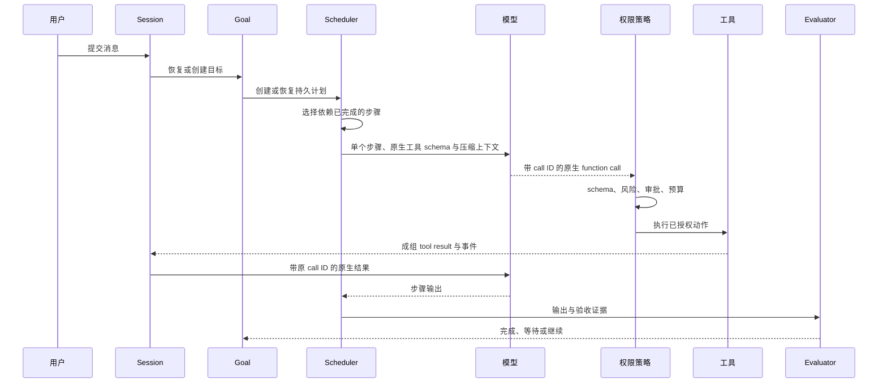

# Your Agent 工程实现

[English](engineering-practice.md) | [简体中文](engineering-practice.zh-CN.md)

`examples/your-agent` 是研究图谱进入可执行代码的位置。当前实现已经不是只有两个工具的 Demo，而是包含真实 Provider、受控宿主能力、持久状态、多种 UI 和发布回归的紧凑 Agent Runtime。

## 当前能力

| 模块 | 理论问题 | 当前实现 |
| --- | --- | --- |
| Agent Loop | 如何把推理变成持续行动 | Scheduler 接管 ready 步骤，每个步骤内部运行 Provider 原生 ReAct |
| Provider | 如何替换模型而不改 Runtime | Responses API 原生 Tool Calling、SSE、有限中断恢复、回退、Cache 与 Usage；保留 DemoModel |
| Tools | 谁能改变环境 | 每步骤受控工具集合；文件、Shell、搜索、网页、澄清、工具化子 Agent、插件和 MCP，统一经过 schema 与策略 |
| Session | 如何跨轮恢复原生对话语义 | canonical turn/event、原生 blocks、事务提交与 L0/L1/L2/L3 送模压缩 |
| Goal | 一个目标如何跨轮和重启存续 | 独立生命周期、pause/resume/clear、累计 Token 与轮次 |
| Planning | 计划如何恢复与验证 | 持久 DAG、依赖调度、角色并行、Verifier、人工验收 |
| Memory | 什么应成为跨任务知识 | 带 scope、来源、置信度、状态和检索预算的 SQLite |
| Evaluation | 何时真正完成 | 确定性报告检查、步骤证据与人工验收 |
| Observability | 如何比较成本和失败 | JSONL 轨迹、Run 指标、累计成功率、摘要用量 |
| Delivery | 用户能否通过真实入口复用能力 | CLI/readline/TUI、有界 HTTP 队列、可恢复 SSE、Web/飞书、E2E、浏览器回归、跨平台发布 |

## 运行链路



核心工程规则是：模型提出，宿主校验、执行、持久化并验收。

## Provider 原生 Tool Calling

`internal/provider/openai.go` 负责 HTTP 与 SSE，解析增量文本和最终 Usage，记录 Prompt Cache Token，对 429/5xx 做有限重试，并按模型回退链继续。API Key 只从环境读取，`store=false` 让 Agent 状态留在本地。

异步 SSE 只在尚未输出语义时重试。Provider 已输出完整 `output_item.done` block 后，Runtime 可以不重放请求地挽救这些块：完整工具调用只执行一次，匹配结果写入历史，再持久化一条要求模型继续且不重复成功工作的原生 user 消息；残缺 block 或非法参数安全失败。

`internal/model/openai.go` 仍让模型生成结构化计划，解析后先校验再持久化；步骤执行不再要求模型输出 JSON Controller 决策。Runtime 把工具作为 Responses API 原生 schema 发送，保留 assistant tool-call blocks，并用原 call ID 成组回送 tool-result blocks。Tool Registry 仍是实际执行的授权边界。

## 工具是权限边界

每次调用依次经过注册与 allowlist、参数 schema、风险分级、审批策略、超时/取消、输出序列化与字节预算，最后才成为 Observation 和指标。当前 Runtime 已提供真实文件、Shell、grep/glob、本地语义符号搜索、网页、澄清、Skills 和生命周期子 Agent 能力；`.your-agent/plugins.json` 还能配置命令插件和 MCP stdio Server，外部工具默认视为危险。

Skills 是带 YAML frontmatter 的 Markdown，可从仓库、项目或用户目录加载，并受依赖、单文件和总 Prompt 预算约束。子 Agent 不再是匿名一次性模型调用，而是在 `subagents.db` 中保存稳定 ID、父 Session/Run、超时、取消、结果和失败。每个子 Agent 拥有独立的原生消息历史和有界 ReAct Runtime，通过共享 Registry 与权限策略从自己的授权工具集合中选择调用，并保留 call/result ID；默认禁止递归派生子 Agent。

并行执行是工具显式能力，不是模型权限，而且只对 `read` 风险开放。同一 concurrency lane 内串行，不同只读 lane 可以重叠；Executor 先固定结果槽位，因此即使完成顺序不同，下一条原生 `tool_results` 仍按 Provider call 顺序排列。写入、危险工具与子 Agent 生命周期操作保持串行。

这正是 Toolformer 的工程落地：模型可以学习何时及如何调用工具，但操作系统权限必须属于宿主。

## 持久状态有不同所有者

- **Session** 保存 canonical turn、原生 content blocks、tool protocol、终态与每轮指标。
- **Goal** 保存长任务目标和 continuation 生命周期。
- **Plan** 保存可恢复的步骤、依赖、证据和验收。
- **Memory** 保存跨任务仍有价值的精选事实。
- **Task** 保存异步 HTTP 执行、审批、流式消息、结果和重启中断状态。
- **Subagent** 保存子任务身份、父子关系、生命周期、结果和失败。

Session 指标与 turn 同事务提交；跨 Run Metrics 和脱敏 JSONL Trace 形成独立观察平面。这样不会把聊天历史误当成权限，也不会因上下文压缩丢掉计划状态。

## 无损 Session 压缩

全量消息始终留在 SQLite。L0 把超过 16 KB 的旧 tool result 缩为 4 KB 头尾并完整保留最新结果；L1 把相同工具与标准化参数的更早结果换成 superseded 标记，但不删除 call ID 或 result block；L2 只在普通 user text/image 边界裁剪，保留近期完整 tool protocol，并为旧内容加入确定性 digest；L3 在阈值 75% 后台预生成语义摘要，只在覆盖整个丢弃前缀时采用。摘要有 12 秒硬超时，失败时不阻塞请求而是退回 L2。

Session 以一个用户 turn 作为事务边界。Runtime 先缓冲 user blocks、assistant reasoning、tool call 与匹配结果、最终回答、状态和指标，再用一个 SQLite 事务提交 turn 及全部查询投影。恢复时读取原生 blocks，保留 Provider reasoning payload 和 tool-call ID，修复无效的 call/result 邻接，然后把结构化 items 重新交给 Provider；供人查看的 transcript 只是展示投影，不是 continuation 的事实源。

压缩只作用于送模视图。SQLite 中仍保存完整原生 blocks；保留近期用户轮次时，tool-call/result 对不会被拆开，旧阶段才会进入确定性 digest 或异步语义摘要。每次 ReAct 模型调用前也执行 L0/L1；Provider 报 context-length 后在同一个计划步骤内尝试“最近一轮”和“0 个历史轮次”，不会重启步骤或重复完成的工具。摘要调用、输入输出 Token 和延迟单独记账。Goal 内的 recent observations/context summary 是另一层工作记忆，二者共同对应 HiAgent 的层级思想，但原始轨迹仍可审计。

## Goal、Planning 与 Memory

未完成目标不是从最后一句 Prompt 重建的。`goals.db` 保存身份、状态、Token、轮次和转移历史；用户可通过 CLI 或 HTTP pause、resume、clear 和查看状态。默认零预算表示不限。

计划经过 DAG 校验后写入 `plans.db`。Scheduler 只执行 ready 步骤，支持独立角色并发并记录尝试和证据；确定性 Verifier 检查输出，需要人工的步骤进入 `awaiting_acceptance`。

Scheduler 现在也是主执行链，而不只是查看计划状态的辅助组件。每个 ready 步骤在自己的受控 `allowedTools` 集合内运行有界原生 ReAct，模型可以在一个步骤中组合多个获准工具，但每次调用仍逐一校验；旧的单工具计划在 Validator 中归一化。`/plan resume <id>` 加载同一个计划，把中断遗留的 `running` 步骤恢复为 `pending`，再由 Scheduler 继续，不创建替代计划，也不重复已完成步骤。

旧 JSON Memory 已升级为 SQLite。记录具有 scope、source、confidence、active/archived 状态和时间；同一 `(scope, key)` 更新而不是追加。检索应用条数和字节预算。按照 AgentPoison 的风险模型，召回记忆始终只是带来源证据，不能授予工具权限。

## Evaluation、指标和轨迹

报告先经过确定性 Evaluator，计划步骤还可验证文件、输出或人工验收，模型自称完成不能直接把 Goal 标记为 achieved。发生物质性文件修改后，宿主 Verification Gate 必须真实观察到测试、构建、Lint 或等价命令成功；它可以追加持久化验证步骤，并拒绝只在文本中宣称“已验证”的计划。每次 Run 保存脱敏 JSONL 事件和成功、耗时、模型调用、Token、Cache Token、工具调用/失败/耗时、审批、压缩和 Goal 轮次。CLI 还会读取历史 Run 计算累计成功率。

这些数据为固定任务回归、偏好对、Skill 提取和 RL 提供基础，但本身不是训练框架。

## UI、Adapter 与发布验证

一次性 CLI、readline 历史与 `Ctrl+R` 搜索、Markdown 渲染、全屏 TUI、Web UI、异步 HTTP/SSE 和飞书 sidecar 复用同一 Runtime。Web 工作台还使用持久化任务、Session REST、受工作区边界保护的文件 API 和带同源校验的 WebSocket PTY。飞书负责平台凭据、图片、引用、会话映射和审批卡片；Agent Server 负责 LLM、工具、Goal、Plan 与 Session。

Agent Server 将请求放入有界 Worker Queue。不同 Session 可并发，同一 Session 严格串行，避免两个 HTTP 请求竞争 canonical turn 历史；全局等待数、单 Session 任务数和活跃 Worker 数形成背压。SSE 消息带单调递增 ID，客户端可用 `Last-Event-ID` 或 `after=N` 续流；进程重启后未完成持久任务标记为 `interrupted`，不会重复执行。

```bash
npm test
npm run papers:verify
make build
make e2e
make browser-regression
make open-source-check
make release-snapshot
make verify-release
```

测试覆盖 Provider 流/完整块中断挽救/回退/Cache/Usage、只读工具有序并行、截断 turn 续跑、计划受控工具集合、工具 schema/审批/超时/输出/路径/网络边界、SQLite 生命周期、Session L0/L1/L2/L3 压缩与降级、Goal continuation、计划调度与验收、HTTP 队列并发与 SSE 游标、飞书状态、指标和 UI。GitHub Actions 构建 Linux、macOS、Windows 产物，版本 Tag 生成归档、SHA-256 和可选 Cosign 签名。

## 当前边界

这是一套可复用的 Runtime 机制，不等于已经完成通用论文研究产品或多租户生产服务。PDF 文本提取、引用蕴含校验、浏览器自动化、Memory 冲突处理、租户隔离、飞书加密回调和生产沙箱仍需继续建设。只有稳定任务集、奖励定义和高质量轨迹齐备后，才适合进入 RL。
