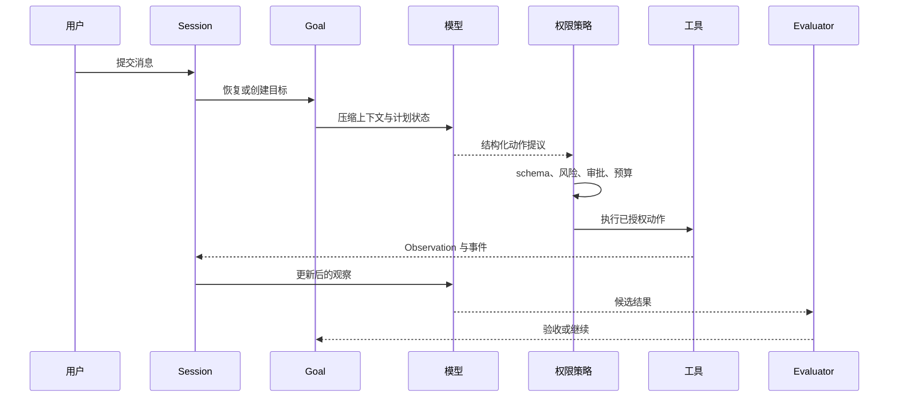

# Paper Agent 工程实现

[English](engineering-practice.md) | [简体中文](engineering-practice.zh-CN.md)

`examples/paper-agent` 是研究图谱进入可执行代码的位置。当前实现已经不是只有两个工具的 Demo，而是包含真实 Provider、受控宿主能力、持久状态、多种 UI 和发布回归的紧凑 Agent Runtime。

## 当前能力

| 模块 | 理论问题 | 当前实现 |
| --- | --- | --- |
| Agent Loop | 如何把推理变成持续行动 | 单个 turn 内 ReAct，外层持久 Goal continuation |
| Provider | 如何替换模型而不改 Controller | Responses API、SSE、回退、重试、Cache 与 Usage；保留 DemoModel |
| Tools | 谁能改变环境 | 文件、Shell、搜索、网页、澄清、子 Agent、插件和 MCP，统一经过 schema 与策略 |
| Session | 如何跨轮恢复而不重放全部历史 | SQLite 消息/事件与 L1/L2/L3 送模压缩 |
| Goal | 一个目标如何跨轮和重启存续 | 独立生命周期、pause/resume/clear、累计 Token 与轮次 |
| Planning | 计划如何恢复与验证 | 持久 DAG、依赖调度、角色并行、Verifier、人工验收 |
| Memory | 什么应成为跨任务知识 | 带 scope、来源、置信度、状态和检索预算的 SQLite |
| Evaluation | 何时真正完成 | 确定性报告检查、步骤证据与人工验收 |
| Observability | 如何比较成本和失败 | JSONL 轨迹、Run 指标、累计成功率、摘要用量 |
| Delivery | 用户能否通过真实入口复用能力 | CLI/readline/TUI/Web/飞书、E2E、浏览器回归、跨平台发布 |

## 运行链路



核心工程规则是：模型提出，宿主校验、执行、持久化并验收。

## Provider 与结构化决策

`internal/provider/openai.go` 负责 HTTP 与 SSE，解析增量文本和最终 Usage，记录 Prompt Cache Token，对 429/5xx 做有限重试，并按模型回退链继续。API Key 只从环境读取，`store=false` 让 Agent 状态留在本地。

`internal/model/openai.go` 将返回内容解析成计划或 Controller 决策。解析成功不是授权，Plan Validator 与 Tool Registry 仍会拒绝结构错误或越权输出。

## 工具是权限边界

每次调用依次经过注册与 allowlist、参数 schema、风险分级、审批策略、超时/取消、输出序列化与字节预算，最后才成为 Observation 和指标。当前 Runtime 已提供真实文件、Shell、grep/glob、网页、澄清和子 Agent 能力；`.paper-agent/plugins.json` 还能配置命令插件和 MCP stdio Server，外部工具默认视为危险。

这正是 Toolformer 的工程落地：模型可以学习何时及如何调用工具，但操作系统权限必须属于宿主。

## 四类持久状态

- **Session** 保存完整消息和结构化事件。
- **Goal** 保存长任务目标和 continuation 生命周期。
- **Plan** 保存可恢复的步骤、依赖、证据和验收。
- **Memory** 保存跨任务仍有价值的精选事实。

Metrics 与 JSONL Trace 形成独立观察平面。这样不会把聊天历史误当成权限，也不会因上下文压缩丢掉计划状态。

## 无损 Session 压缩

全量消息始终留在 SQLite。达到字节或 Token 阈值时，送模视图保留最近用户轮次，并为旧内容加入确定性 digest；OpenAI 模式在阈值 75% 后台预生成语义摘要。摘要有 12 秒硬超时，失败时不阻塞请求而是退回 digest。Provider 报 context-length 后还会尝试“最近一轮”和“仅当前轮”两级恢复。

摘要调用、输入输出 Token 和延迟单独记账。Goal 内的 recent observations/context summary 是另一层工作记忆，二者共同对应 HiAgent 的层级思想，但原始轨迹仍可审计。

## Goal、Planning 与 Memory

未完成目标不是从最后一句 Prompt 重建的。`goals.db` 保存身份、状态、Token、轮次和转移历史；用户可通过 CLI 或 HTTP pause、resume、clear 和查看状态。默认零预算表示不限。

计划经过 DAG 校验后写入 `plans.db`。Scheduler 只执行 ready 步骤，支持独立角色并发并记录尝试和证据；确定性 Verifier 检查输出，需要人工的步骤进入 `awaiting_acceptance`。

旧 JSON Memory 已升级为 SQLite。记录具有 scope、source、confidence、active/archived 状态和时间；同一 `(scope, key)` 更新而不是追加。检索应用条数和字节预算。按照 AgentPoison 的风险模型，召回记忆始终只是带来源证据，不能授予工具权限。

## Evaluation、指标和轨迹

报告先经过确定性 Evaluator，计划步骤还可验证文件、输出或人工验收，模型自称完成不能直接把 Goal 标记为 achieved。每次 Run 保存脱敏 JSONL 事件和成功、耗时、模型调用、Token、Cache Token、工具调用/失败/耗时、审批、压缩和 Goal 轮次。CLI 还会读取历史 Run 计算累计成功率。

这些数据为固定任务回归、偏好对、Skill 提取和 RL 提供基础，但本身不是训练框架。

## UI、Adapter 与发布验证

一次性 CLI、readline 历史与 `Ctrl+R` 搜索、Markdown 渲染、全屏 TUI、Web UI、异步 HTTP/SSE 和飞书 sidecar 复用同一 Runtime。飞书负责平台凭据、图片、引用、会话映射和审批卡片；Agent Server 负责 LLM、工具、Goal、Plan 与 Session。

```bash
npm test
npm run papers:verify
make build
make e2e
make browser-regression
make open-source-check
make release-snapshot
make verify-release
```

测试覆盖 Provider 流、回退、Cache 和 Usage，工具 schema/审批/超时/输出/路径/网络边界，SQLite 生命周期，Session L1/L2/L3 压缩与降级，Goal continuation，计划调度与验收，HTTP/飞书状态、指标和 UI。GitHub Actions 构建 Linux、macOS、Windows 产物，版本 Tag 生成归档、SHA-256 和可选 Cosign 签名。

## 当前边界

这是一套可复用的 Runtime 机制，不等于已经完成通用论文研究产品或多租户生产服务。PDF 文本提取、引用蕴含校验、浏览器自动化、Memory 冲突处理、租户隔离、飞书加密回调和生产沙箱仍需继续建设。只有稳定任务集、奖励定义和高质量轨迹齐备后，才适合进入 RL。
