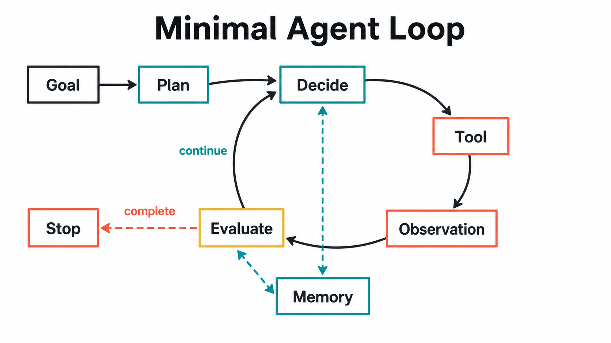

# Paper Agent Runtime

[English](README.md) | [简体中文](README.zh-CN.md)

Paper Agent 是一个用 Go 实现、以论文理论为设计依据的通用 Agent Runtime。它保留可离线回归的 `DemoModel`，同时支持 OpenAI-compatible Responses API 流式输出与模型回退、Prompt Cache 指标、受控文件和 Shell 工具、网页、澄清、子 Agent、插件与 MCP、结构化 Session、独立 Goal、可恢复 Planning、SQLite Memory、三层上下文压缩、readline CLI、TUI、Web UI 和飞书入口。



## 运行方式

在仓库根目录构建站点和三个 Go 程序：

```bash
make build
```

产物位于 `dist/bin/`。启动持久交互终端：

```bash
dist/bin/paper-agent -interactive -provider demo
```

交互终端使用 readline，支持持久历史、`Ctrl+R` 搜索和补全。命令包括 `/session`、`/memory`、`/model`、`/goal pause|resume|clear|status`、`/plan show|list|resume|accept`、`/todo`、`/paste`、`/clear` 和 `/exit`。运行中可以用 `Ctrl+C` 取消当前任务而不丢失 Session。

全屏 TUI：

```bash
dist/bin/paper-agent -tui -provider demo
```

在仓库根目录运行离线模式：

```bash
npm run agent -- "解读一篇关于 Agent Memory 的论文"
```

也可以在当前目录运行：

```bash
go run ./cmd/paper-agent -provider demo "解读 Tool Use 的代表性论文"
```

真实模型模式只从环境变量读取 API Key：

```bash
export OPENAI_API_KEY="..."
export OPENAI_MODEL="your-model-id"

go run ./cmd/paper-agent \
  -provider openai \
  -fallback-models "fallback-a,fallback-b" \
  "解读 Agent Planning 的代表性论文"
```

兼容 OpenAI Responses API 的网关可以通过 `OPENAI_BASE_URL` 或 `-base-url` 接入。模型 ID 不在代码中写死，避免把某个时间点的模型列表固化进项目。

## HTTP 与飞书入口

`paper-agent-server` 提供 Verdent 风格的异步任务协议：

```bash
dist/bin/paper-agent-server -provider openai
```

浏览器打开 `http://127.0.0.1:18080/` 即可使用内嵌 Web UI。核心端点还包括 `/api/agent/events` SSE、`/api/goal/status|action` 和 `/api/plan/latest|accept`。异步任务具有 `running`、`pending_approval`、`completed`、`failed`、`canceled` 状态；相同 `session_id` 会继续既有对话。

飞书适配器复用这组 API，支持消息、引用、富文本、图片、群聊显式 @、事件去重、任务轮询、取消和审批卡片。配置方法见 [飞书适配器](../../docs/feishu-adapter.zh-CN.md)。LLM API Key 只属于 Agent Server，飞书 sidecar 不读取它。Verdent 的 scheduler notifier 没有复制，因为 Paper Agent 当前没有定时任务子系统。

## Agent Loop

一次运行包含两层循环：

1. 内层 ReAct 循环在一个 Goal turn 内执行 `Decide -> Tool -> Observation`，默认最多 6 步。
2. 如果报告尚未通过 Evaluator，外层 Goal continuation 会压缩旧 observation 并进入下一轮。`goal-turns=0` 和 `token-budget=0` 默认均表示不限；仍可通过取消、暂停、Evaluator 或显式预算停止。

模型生成的计划在执行前必须通过程序校验：步骤 ID 唯一、依赖存在、依赖图无环、工具来自 allowlist、成功条件非空。模型输出不直接获得执行权限。

## OpenAI Provider

`internal/provider/openai.go` 使用 Responses API：

- Bearer Token 认证，API Key 不写入配置和日志
- 支持自定义 Base URL
- SSE 增量输出，最终报告流不会泄露 Controller JSON
- 429 和 5xx 有限重试、退避与模型 fallback chain
- `prompt_cache_key`，记录 cache read/create token
- 单请求超时和响应大小限制
- 读取 `input_tokens`、`output_tokens` 和 `total_tokens`
- `store=false`，完整 Agent 状态由本地 runtime 管理

官方 OpenAI 地址会发送 `max_output_tokens`。自定义 OpenAI-compatible Base URL 按 Verdent 的兼容策略省略该可选字段，因为不少企业网关会直接拒绝它；这类网关应在服务端配置输出上限，Paper Agent 仍保留响应体字节限制。

`internal/model/openai.go` 在 Provider 上实现两个结构化决策：生成计划和选择工具/最终回答。返回内容必须能解析为约定 JSON，随后仍要经过本地计划校验、工具 schema 校验和 Evaluator。

## 工具安全

工具注册项包含 `read`、`write`、`dangerous` 风险等级。`write` 和 `dangerous` 默认需要审批；非交互环境的 `ask` 模式会拒绝执行。每个工具还受到以下边界约束：

- allowlist 与参数 schema
- 单工具超时
- 序列化输出字节预算
- 结构化大结果拒绝，字符串大结果截断
- 工具失败作为 observation 返回给模型
- 审批次数、耗时和失败次数进入运行指标

内置工具包括 `file_read`、`file_write`、`file_edit`、`list_dir`、`glob`、`grep`、`bash`、`web_fetch`、`web_search`、`clarification`、`subagent`、`search_papers` 和 `read_paper_card`。文件工具拒绝工作区逃逸和符号链接绕过；网页工具拒绝私网、回环、链路本地地址和不安全重定向。

项目可在 `.paper-agent/plugins.json` 注册命令插件或 MCP stdio server。外部工具会获得 `plugin__...` 名称并默认标记为 `dangerous`，仍须通过 schema、超时、输出预算和人工审批：

```json
{
  "version": 1,
  "plugins": [{
    "name": "lookup",
    "command": ["./bin/lookup"],
    "input_schema": {"type":"object","properties":{"query":{"type":"string"}},"required":["query"]}
  }],
  "mcp_servers": [{"name":"workspace","command":["npx","-y","@example/mcp-server"]}]
}
```

## Goal 与持久 Planning

Goal 独立保存在 `.agent-data/goals.db`，按 Session 绑定但不混入消息表。它支持 `pause`、`resume`、`clear`、`auto_resume`、累计 token、轮次和状态历史；进程重启后继续的是同一个目标，而不是重新包装一条 Prompt。

模型生成的 DAG 保存在 `.agent-data/plans.db`。每个步骤保存依赖、角色、状态、尝试次数、证据和 acceptance checks。Scheduler 只调度依赖已完成的步骤，可并行运行 researcher/reviewer 等独立角色；文件和输出检查由确定性 Verifier 执行，`human` 检查进入 `awaiting_acceptance`，由 CLI 或 HTTP 显式验收。

## SQLite Memory

长期记忆保存在 `.agent-data/memory.db`。每条记录包含：

- `scope`：当前支持任意命名空间，运行时默认检索 `user`、`project`、`learning-preference`
- `source` 和 `confidence`
- `active` / `archived` 生命周期状态
- 创建、更新和最近使用时间
- `(scope, key)` 唯一约束，用于更新已有记忆

检索会同时应用条数预算和字节预算，再按 scope、关键词、置信度和更新时间排序。明显包含 API Key、Token 或密码的内容会被拒绝写入。

## Session Compaction

Session 完整历史保存在 `.agent-data/sessions.db`，压缩只改变下一次送给模型的视图，不删除数据库消息。默认在渲染上下文超过 400 KB，或上一轮输入超过 120K tokens 时触发：

- 在用户轮次边界裁剪，默认保留最近 4 个用户轮次
- L1：先对重复内容和超大旧消息做 micro compaction
- L2：始终用确定性 digest 保留旧目标、结论、错误与 URL
- L3：OpenAI 模式在压缩阈值 75% 时后台预生成语义摘要，单次硬超时 12 秒；压缩时只非阻塞取已就绪且覆盖范围足够的摘要
- L3 失败、超时或尚未就绪时自动退回 L2，不阻塞当前用户请求
- Provider 返回 context-length 错误时，依次缩到最近 1 轮和仅当前轮，最多恢复两次

CLI、HTTP Server 和飞书使用同一语义。摘要调用数、输入/输出 Token 与耗时累计在 Session SQLite，可由 `/session` 或 `/api/session/status` 查看。这里解决的是跨对话轮次的 Session 窗口；Agent Loop 内部还有一层 observation 压缩。

L3 在 `provider=openai` 时默认开启；离线、配额受限或故障注入测试可设置 `PAPER_AGENT_SESSION_LLM_SUMMARY=0` 显式关闭。

## Agent Context Compaction

运行时把上下文拆成三层：

- `recentObservations`：保留工具调用的近期细节
- `contextSummary`：压缩过往 observation，保留论文 ID、URL、失败和未完成事项
- SQLite Memory：保存跨任务仍有价值的稳定信息

OpenAI 模式使用模型生成阶段摘要；压缩调用失败时退回确定性 JSON 摘要，因此 continuation 不依赖额外一次模型调用必然成功。

## Metrics 与轨迹

每次运行的 JSONL 轨迹保存在 `.agent-data/runs/<run-id>.jsonl`，敏感字段在写入前脱敏。跨运行指标保存在 `.agent-data/metrics.db`，CLI 会根据历史 Run 计算累计任务成功率。`metrics_recorded` 事件包含：

```text
success
duration_ms
llm_calls
input_tokens / output_tokens / total_tokens
tool_calls / tool_failures / tool_duration_ms
human_approval_requests
context_compactions
goal_turns
cache_read_input_tokens / cache_creation_input_tokens
```

CLI 会在任务结束时输出这些核心指标。Token 指标依赖 Provider 返回的 usage；离线 `DemoModel` 的 token 数为 0。Session L3 摘要是独立模型调用，其调用数、Token 和延迟记录在 `sessions.db`，不会从成本口径中消失。

## 理论映射

| Runtime 机制 | 对应理论与论文 |
| --- | --- |
| `Decide -> Tool -> Observation` | ReAct：把推理和行动组成反馈闭环 |
| 工具选择、schema 与宿主执行 | [Toolformer](../../ai-agent-roadmap-site/assets/pdfs/toolformer.pdf)：工具调用是模型策略，但权限属于运行时 |
| 结构化计划与依赖校验 | [Understanding the Planning of LLM Agents](../../ai-agent-roadmap-site/assets/pdfs/understanding-the-planning-of-llm-agents.pdf)：计划生成之后还需要监控和验证 |
| scope、状态、来源和检索预算 | [Memory in the LLM Era](../../ai-agent-roadmap-site/assets/pdfs/memory-in-the-llm-era.pdf) 与 [A-MEM](../../ai-agent-roadmap-site/assets/pdfs/a-mem-agentic-memory.pdf)：记忆需要生命周期，不是 append-only 日志 |
| recent / summary / long-term 三层上下文 | [HiAgent](../../ai-agent-roadmap-site/assets/pdfs/hiagent.pdf)：长任务需要层级工作记忆 |
| Token、延迟、工具和压缩指标 | [Toward Efficient Agents](../../ai-agent-roadmap-site/assets/pdfs/toward-efficient-agents.pdf)：在成功率与计算成本之间联合优化 |

这些论文提供设计原则，代码实现仍采用可验证的工程约束。例如，模型负责提出计划，但 DAG 合法性由程序判断；模型建议调用工具，但工具权限、参数和超时由宿主控制。

## 目录

| 文件 | 职责 |
| --- | --- |
| `cmd/paper-agent/main.go` | CLI、Provider 配置、人工审批与指标输出 |
| `cmd/paper-agent-server/main.go` | 异步任务、Session、取消和审批 HTTP 服务 |
| `cmd/feishu-adapter/main.go` | 飞书回调 sidecar |
| `internal/agent/agent.go` | ReAct、Goal continuation、上下文压缩和停止条件 |
| `internal/session/` | 完整会话持久化、L1/L2/L3 送模视图压缩、摘要预热与超限恢复 |
| `internal/server/server.go` | 异步任务状态机与 HTTP 协议 |
| `internal/integrations/feishu/` | 飞书事件、图片、卡片、映射和 API Client |
| `internal/ui/ui.go` | 并发安全终端输出、spinner、审批和交互命令 |
| `internal/provider/openai.go` | OpenAI-compatible Responses Provider |
| `internal/model/` | Demo 与 OpenAI Planner/Controller |
| `internal/planning/` | DAG 校验、SQLite 状态、依赖调度、Verifier 与人工验收 |
| `internal/tools/`、`internal/plugin/` | 内置工具、权限、插件与 MCP stdio |
| `internal/goal/` | 独立 Goal 生命周期与 continuation |
| `internal/input/`、`internal/render/`、`internal/tui/` | readline、Markdown 与全屏 TUI |
| `internal/memory/store.go` | SQLite 记忆生命周期与预算检索 |
| `internal/metrics/store.go` | Run 指标持久化与累计任务成功率 |
| `internal/evaluator/report.go` | 确定性报告验收条件 |
| `internal/trajectory/logger.go` | 并发安全、可脱敏的 JSONL 轨迹 |
| `internal/app/factory.go` | 运行时装配与资源生命周期 |

## 参数

```text
-provider demo|openai
-model <model-id>
-fallback-models <id,id>
-base-url <openai-compatible-base-url>
-max-steps 6
-goal-turns 0
-token-budget 0
-context-observations 4
-max-output-tokens 4096
-tool-timeout 30s
-tool-output-bytes 65536
-approval ask|deny|allow
-data-dir .agent-data
-interactive
-tui
-session-id <id>
-session-trigger-bytes 400000
-session-trigger-tokens 120000
-session-recent-turns 4
```

`token-budget=0` 和 `goal-turns=0` 均表示不设置本地上限；每个 Goal turn 仍受 `max-steps` 控制。`approval=allow` 只适合受控自动化环境。

## 验证

需要 Go 1.25 或更高版本。SQLite 使用纯 Go 的 `modernc.org/sqlite` 驱动，Windows 构建不再需要 CGO 或 C 编译器。

```bash
GOCACHE="$PWD/.gocache" go test ./...
```

仓库根目录还提供：

```bash
make e2e                 # CLI + HTTP 真实进程回归
make browser-regression  # Playwright 桌面与移动端回归
make open-source-check   # secret、格式、vet、测试、内容检查
make release-snapshot    # 本机归档与 SHA-256；安装 cosign 时同时签名
make verify-release
```

GitHub Actions 在 Linux、macOS、Windows 原生构建和测试；`v*` Tag 会归档三套二进制、生成校验和，并用 GitHub OIDC + Cosign 进行 keyless 签名。

测试覆盖离线完整轨迹、OpenAI 请求与图片/usage 解析、计划依赖环、工具白名单/审批/超时/输出预算、SQLite scope/归档/检索预算、Session L1/L2/L3 压缩、异步摘要失败降级和完整历史保留、Session 保存与 Fork、HTTP 跨轮继续、飞书事件/图片/卡片/审批、累计任务成功率，以及跨 3 个 Goal turn 的 continuation 和上下文压缩。

当前 OpenAI 路径通过模型返回 JSON 驱动本地工具，并未依赖 Provider 原生 function-call event；这让 OpenAI-compatible 网关更容易接入，也意味着模型输出校验是不可省略的边界。
